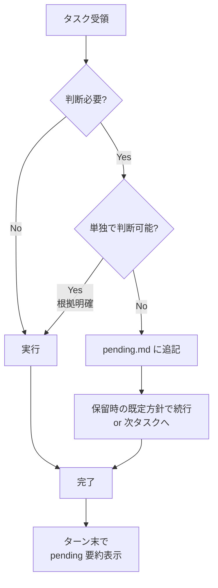

# 自律実行ルール（常時適用）

> このルールはスコープ指定なしで**常時ロード**される。すべての作業で適用。

## 基本原則

**止まらずに進め、判断できないものは記録して次へ。**

ユーザーは各応答に対して毎回返答できるわけではない。Claude は判断保留をブロッカーにせず、可能な限り作業を前に進める責務を負う。

## 実行フロー



## 判断レベルの分類

| レベル | 例 | 対応 |
|-------|-----|------|
| L1: 自明 | 既存パターンの延長、バグの自明な修正 | **そのまま実行** |
| L2: 根拠あり | 公式ドキュメント・調査結果から判断可能 | **実行 + 根拠を `docs/decisions/resolved.md` に記録** |
| L3: トレードオフあり | 複数案の優劣が運用依存 | **pending.md に記録し、推奨既定で続行** |
| L4: 破壊的・不可逆 | データ削除、本番デプロイ、秘匿情報 | **必ずユーザー確認（pending.md にブロッカー付与）** |

## 禁止事項

- ❌ 会話メッセージで「A と B どちらがよいですか？」と投げかけて止まる
- ❌ pending.md に登録せずにユーザー判断を待つ
- ❌ 「既定方針で続行」と書いた項目で手を止める
- ❌ ターン末の pending 要約表示を省略する

## 必須事項

- ✅ 判断項目は `docs/decisions/pending.md` に `D-NNN` 形式で追記
- ✅ 各項目に「保留時の既定（推奨）」を必ず書く
- ✅ ブロッカー（🔴）の場合のみ該当タスクをスキップし、他の独立タスクを進める
- ✅ ユーザー回答を受領したら `pending.md` → `resolved.md` に移動
- ✅ **各応答の最後に pending.md の未解決項目を表示**

## ターン末の表示フォーマット

応答の末尾に以下を付与:

```
---
## ⏳ 判断待ち（docs/decisions/pending.md）

- 🔴 D-001: バックフィル方針 — 既定: C（注釈のみ）
- 🟡 D-002: 料金ソース — 既定: A（LiteLLM JSON）
- 🟡 D-003: npm 公開範囲 — 既定: A（公開 npm）

全件未解決の場合は「全 N 件」、0 件の場合は表示不要。
```

## 例外

以下は pending.md への記録を省略してよい:
- ユーザーが明示的に「聞いてください」と指示している対話的フロー
- セキュリティ / 法的な判断（常に停止して確認）
- 破壊的操作（rm -rf, force push, DB drop 等）
