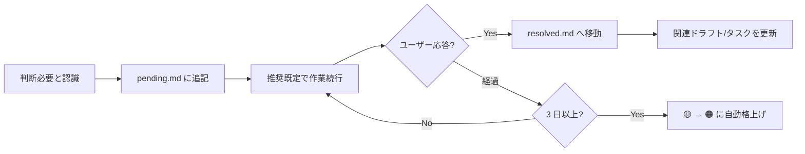

---
paths:
  - "docs/decisions/**/*"
---

# 判断待ちファイル運用ルール

## ファイル配置

- [`docs/decisions/pending.md`](../../docs/decisions/pending.md) — 現在の判断待ち（SSOT）
- [`docs/decisions/resolved.md`](../../docs/decisions/resolved.md) — 判断済み履歴

## スキーマ（必須）

`pending.md` の各エントリは以下の構造を守る:

```markdown
### D-NNN / YYYY-MM-DD / 🟡

**項目**: （1 行で何を決めたいか）

**背景**: （なぜ判断が必要か、現状何が起きているか）

**選択肢**:
- A. ○○
- B. △△

**推奨（保留時の既定）**: A  ← 必須：ユーザー無応答時の自律継続方針

**ブロックされるタスク**: T-XX, T-YY  ← 独立タスクは「なし」

**関連ドラフト / タスク**: docs/draft/XXX.md
```

### 必須項目

| 項目 | 必須 | 理由 |
|------|------|------|
| ID (D-NNN) | ✅ | 連番で衝突防止 |
| 起票日 (YYYY-MM-DD) | ✅ | 経過日数判定に使用 |
| ステータス絵文字 | ✅ | 🟡 新規 / 🟠 3日超 / 🔴 ブロッカー |
| 項目 | ✅ | |
| 背景 | ✅ | 再開時の理解 |
| 選択肢 | ✅ | 最低 2 択 |
| **推奨（保留時の既定）** | ✅ | 自律継続に必須 |
| ブロックされるタスク | ✅ | 無い場合は「なし」と明記 |
| 関連ドラフト/タスク | ✅ | トレーサビリティ |

## ライフサイクル



## 絵文字の昇格ロジック

各ターン開始時に Claude が pending.md を読み、現在日と起票日を比較:

- 起票から **3 日未満** → 🟡
- 起票から **3 日以上** → 🟠（未対応）
- 明示的にブロッカー扱い → 🔴（手動付与）

## ID 採番

- 連番（D-001, D-002, ...）
- `pending.md` と `resolved.md` を跨いで一意
- 採番は Claude が自動で実行（最大値 + 1）

## resolved.md への移動

ユーザー判断が下った場合:

1. `pending.md` から該当ブロックを削除
2. `resolved.md` に以下を追記:

```markdown
## D-NNN: （項目）

- **起票日**: YYYY-MM-DD
- **決定日**: YYYY-MM-DD
- **決定**: A / B / C ...
- **決定者**: ユーザー / Claude（既定運用）
- **理由**: （1〜2 行）
- **関連ドラフト / タスク**: ...
```

3. 関連ドラフト/タスクのファイルにも決定を反映

## 既定運用で進めた項目

推奨既定でそのまま実装を進めた場合も、実装完了時点で `resolved.md` に移動する（決定者を「Claude（既定運用）」と記録）。ユーザーが後から別の判断を下したい場合は、その時点で差し戻す。

## ターン末の表示

各応答の最後に、未解決項目を要約表示（`autonomy.md` 参照）。
表示は**Claude の責務**であり、省略不可。
