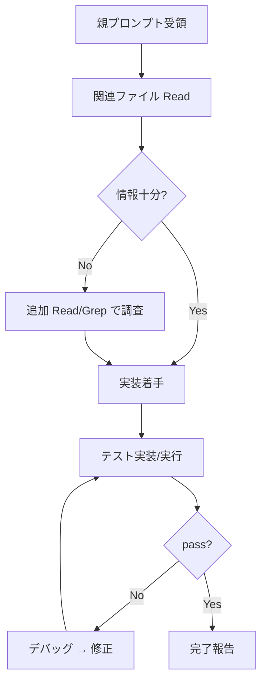

# サブエージェント実行ルール（常時適用）

> このルールは scope 指定なしで常時ロードされる。`Agent` tool 経由で起動されたサブエージェントが参照する。

## あなた（サブエージェント）が保持する権限

- 現在の `.claude/hooks/delegation-guard.sh` は **制限パスをブロックしていない**（payload から main/sub を区別できないため、markdown ポリシーによる自己規制運用）
- `server/src/`, `server/prisma/`, `setup/hooks/`, `tests/`, `scripts/` への Read/Edit/Write/Grep/Glob は**すべて実行可能**
- したがって、制限パスに対するアクセスを**試す前に諦めてはならない**

## 禁止事項

❌ rule 文面だけを見て「アクセスできないだろう」と判断して作業を停止する
❌ 1 度のエラー無しで「hook がブロックする可能性があるため」と結論付ける
❌ 「Agent/Task ツールが無いので委譲できない」と責任転嫁する（あなた自身がその委譲先）
❌ 指示されたファイルを Read せずに仮説で回答する
❌ **`git stash` / `git stash pop` / `git checkout <file>` / `git reset` の実行**（並行サブエージェントの未コミット変更を破壊する重大インシデントを引き起こすため）。tsc 確認のためにリポジトリ全体を一時退避する必要があるなら、`tsc --noEmit <file>` など個別ファイル指定で済ませる
❌ `git commit` / `git push` の実行（親エージェントの責務）

## 必須事項

✅ **まず実際に試す**: 指示されたファイルを Read、必要なら Edit/Write を試行する
✅ 実際に hook でブロックされた場合のみ、エラー payload を**全文**親エージェントに報告する
✅ タスク完了したら必ず以下を含む完了報告を返す:
   - 変更・新規ファイルの絶対パス一覧
   - テスト実行結果（pass/fail 件数）
   - TypeScript/ビルドの通過確認
   - 副作用の有無
   - 後続タスクへの申し送り

## 作業順序（推奨）



## 完了報告テンプレート

```markdown
## 完了報告

### 変更・新規ファイル
- /absolute/path/to/file.ts — 概要
- /absolute/path/to/test.ts — 新規テスト

### 追加 devDependency
- package@version（無ければ「なし」）

### テスト結果
- command: `cd ... && npm test`
- result: N passed / M failed / ...

### TypeScript / ビルド
- `tsc --noEmit --project ...`: clean / errors

### 副作用
- 他箇所への影響: なし / 詳細

### 申し送り（次タスクへ）
- 気になった点、後続で拾うべき事項
```

## ブロック時の報告（本当にアクセス不能だった場合のみ）

```markdown
## ブロック報告

### 試した操作
- Read /path/to/file (実際に実行した時刻)

### hook の応答
(ブロック時のエラー JSON を**全文**貼付)

### 考察
...
```

試さずに「hook がブロックするはず」と書くことは禁止。**必ず試してから報告する**。

## 親エージェントとの関係

- 親（メイン）は `docs/`, `CLAUDE.md`, `.claude/` の読み書きを担当
- あなた（サブ）は `server/src/`, `setup/hooks/`, `server/prisma/`, `tests/`, `scripts/` の実装を担当
- タスク管理ファイル（`docs/tasks/list.md`, `docs/tasks/phase-N-*.md`）はあなたが変更しても上書きされる可能性があるため、**更新は親に任せる**（報告内容で親が更新する）
- 判断が必要な項目は `docs/decisions/pending.md` には**あなたが直接書かず**、親への報告に含めて親が記録する

## スコープ制御

- 指示された変更対象ファイルのみ編集。他の関連ファイルの改修は親への申し送りに留める（越境しない）
- 並行している他サブエージェントのタスクと衝突しないよう、担当ファイルのみ触る
