# AI駆動開発における生産性KPI企画書

## AI活用度を定量的に測定するための指標体系

> 作成日: 2026-02-15
> 対象: Claude Code Activity Tracker プロジェクト

---

## 目次

1. [エグゼクティブサマリー](#1-エグゼクティブサマリー)
2. [背景と課題](#2-背景と課題)
3. [KPI体系の全体像](#3-kpi体系の全体像)
4. [Tier 1: セッション効率指標](#4-tier-1-セッション効率指標)
5. [Tier 2: AI活用品質指標](#5-tier-2-ai活用品質指標)
6. [Tier 3: 自律性・成熟度指標](#6-tier-3-自律性成熟度指標)
7. [Tier 4: コスト効率指標](#7-tier-4-コスト効率指標)
8. [指標の健全な範囲（ベンチマーク）](#8-指標の健全な範囲ベンチマーク)
9. [測定アーキテクチャ](#9-測定アーキテクチャ)
10. [段階的導入ロードマップ](#10-段階的導入ロードマップ)
11. [参考文献](#11-参考文献)

---

## 1. エグゼクティブサマリー

従来の開発生産性指標（ストーリーポイント、ベロシティ、アウトカム等）では、**AIをどれだけ上手く使えているか**を測定できない。METR の2025年RCT研究では、AI利用を許可された開発者が実際には**19%遅くなる**という結果が出ており、「AIを使っている＝生産的」ではないことが明らかになった。

本企画書では、**AIの活用度・習熟度そのもの**を定量化する4階層のKPI体系を提案する。

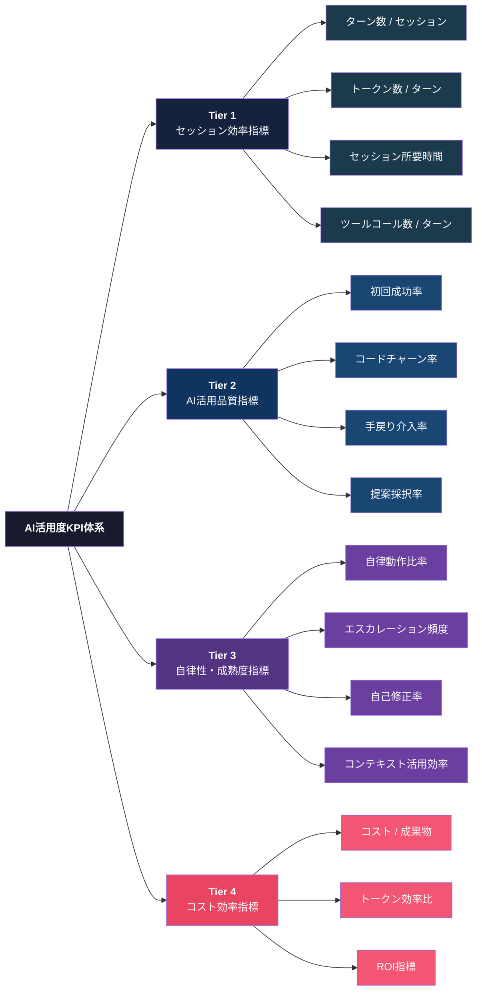

---

## 2. 背景と課題

### 2.1 従来指標の限界

| 従来指標 | 問題点 |
|---------|--------|
| ストーリーポイント | AIが作業しても人間が作業してもSPは同じ |
| ベロシティ | チーム比較に使えない。インフレしやすい |
| コード行数 | AI生成コードは量が増えても品質が伴わない場合がある |
| サイクルタイム | ボトルネックがコーディング→レビューに移動しただけの可能性 |

### 2.2 METR研究の示唆

2025年のMETR（AI安全性研究組織）によるRCT研究の主要な知見:

- 開発者は「AIで24%速くなる」と**予測**したが、実際は**19%遅くなった**
- 予測と実績のギャップは**43ポイント**
- 原因: コンテキスト説明のオーバーヘッド、AI出力の検証時間、過度な依存

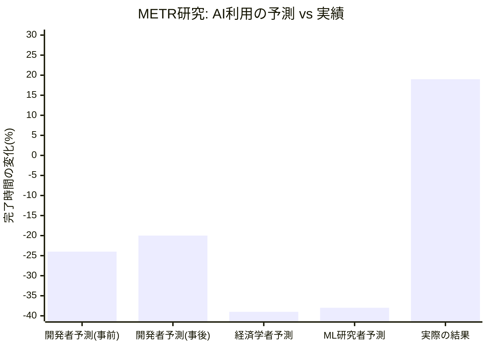

この結果は**AI活用の「質」を測定し改善する必要性**を強く示唆している。

---

## 3. KPI体系の全体像

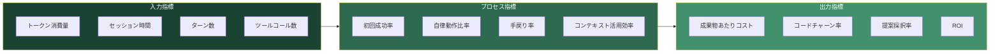

---

## 4. Tier 1: セッション効率指標

セッションレベルでAI利用の「形」を把握する基礎指標。

### 4.1 ターン数 / セッション (Turns per Session)

| 項目 | 内容 |
|------|------|
| **定義** | 1セッション内でのユーザー⇔AI間の往復回数 |
| **計測方法** | Hook（stop時）で `conversation_turns` を取得 |
| **意味** | 少ない＝明確な指示で完了。多すぎ＝指示が曖昧or手戻り |

**健全な範囲の目安:**

| 状態 | ターン数 | 解釈 |
|------|---------|------|
| 優秀 | 3-8 | 明確なプロンプトで1回で目的達成 |
| 標準 | 9-20 | 通常の対話的開発 |
| 要改善 | 21-40 | プロンプト設計の見直しが必要 |
| 非効率 | 40+ | タスク分割不足、またはAIに不向きなタスク |

### 4.2 トークン数 / ターン (Tokens per Turn)

| 項目 | 内容 |
|------|------|
| **定義** | 1ターンあたりの平均入出力トークン数 |
| **計測方法** | API応答の `usage.input_tokens` / `usage.output_tokens` |
| **意味** | 入力トークン過多＝コンテキスト肥大化。出力トークン過多＝冗長な応答 |

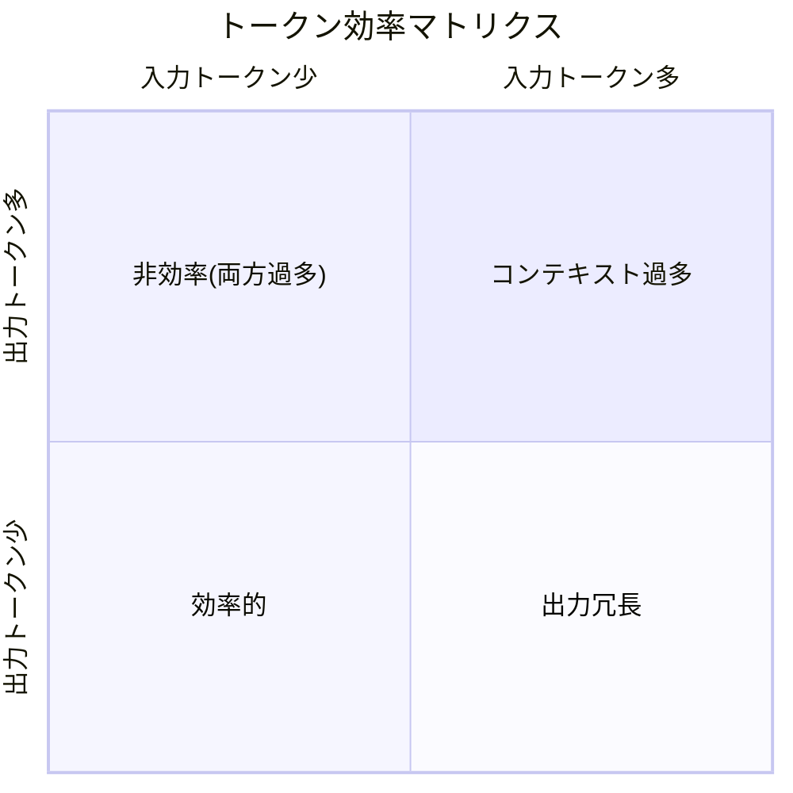

### 4.3 セッション所要時間 (Session Duration)

| 項目 | 内容 |
|------|------|
| **定義** | セッション開始から終了までのウォールクロック時間 |
| **計測方法** | Hook の `init` と `stop` のタイムスタンプ差分 |
| **サブ指標** | API待ち時間 vs ユーザー思考時間の比率 |

### 4.4 ツールコール数 / ターン (Tool Calls per Turn)

| 項目 | 内容 |
|------|------|
| **定義** | AIが1ターンで実行するツール呼び出しの平均数 |
| **計測方法** | transcript解析で `tool_use` イベントをカウント |
| **意味** | 適切なツール選択ができているかの指標 |

---

## 5. Tier 2: AI活用品質指標

AI出力の**有効性**を測定する指標群。

### 5.1 初回成功率 (First-Pass Success Rate)

| 項目 | 内容 |
|------|------|
| **定義** | AIの最初の提案がそのまま（修正なしで）採用される割合 |
| **計算式** | `修正なし採用数 ÷ 全提案数 × 100` |
| **目標値** | 60%以上（業界平均は40-50%程度） |

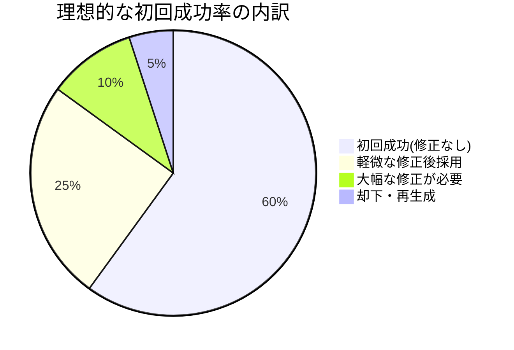

### 5.2 コードチャーン率 (Code Churn Rate)

| 項目 | 内容 |
|------|------|
| **定義** | AI生成コードが短期間（72時間以内）に書き直される割合 |
| **計算式** | `72h以内の変更行数 ÷ AI生成行数 × 100` |
| **警戒値** | 30%以上で品質問題の兆候 |

研究によると、AI支援コードではコード重複が**4倍**に増加し、短期チャーン率も上昇傾向にある。

### 5.3 手戻り介入率 (Human Intervention Rate)

| 項目 | 内容 |
|------|------|
| **定義** | AIの動作を修正・中断するために人間が介入した割合 |
| **計算式** | `介入ターン数 ÷ 全ターン数 × 100` |
| **目標値** | 15%以下 |

介入の種類を分類して記録:

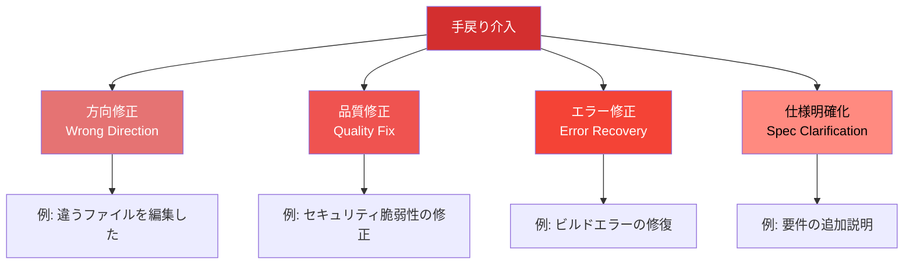

### 5.4 提案採択率 (Suggestion Acceptance Rate)

| 項目 | 内容 |
|------|------|
| **定義** | AIの提案（コード変更、コマンド実行等）を承認した割合 |
| **計測方法** | Hook で `tool_use` の許可/拒否を記録 |
| **バランス** | 高すぎ＝盲目的受容、低すぎ＝AI活用不足 |

---

## 6. Tier 3: 自律性・成熟度指標

開発者のAI活用**スキル**を測定する高度な指標。

### 6.1 自律動作比率 (Autonomy Ratio)

| 項目 | 内容 |
|------|------|
| **定義** | AI が人間の介入なしに連続実行できたステップ数の割合 |
| **計算式** | `自律ステップ数 ÷ 全ステップ数 × 100` |
| **意味** | プロンプト設計と CLAUDE.md 等の環境整備の成熟度を反映 |

研究によると、本番環境のAIエージェントの68%は**10ステップ以内**で人間の介入が必要になる。

### 6.2 エスカレーション頻度 (Escalation Frequency)

| 項目 | 内容 |
|------|------|
| **定義** | AI が `AskUserQuestion` 等で判断を人間に委ねた頻度 |
| **最適値** | ゼロではなく適度な頻度（過度な自律はリスク） |

### 6.3 自己修正率 (Self-Correction Rate)

| 項目 | 内容 |
|------|------|
| **定義** | AI が自分の誤りを検出し、人間の指摘なしに修正した割合 |
| **計測方法** | transcript で「修正します」「訂正」等のパターンを検出 |
| **意味** | テスト実行→失敗→修正のループを自律的に回せているか |

### 6.4 コンテキスト活用効率 (Context Utilization Efficiency)

| 項目 | 内容 |
|------|------|
| **定義** | コンテキストウィンドウの使用率と有効活用度 |
| **計算式** | `有効コンテキスト量 ÷ 消費コンテキスト量` |
| **意味** | `/clear` の適切なタイミング、CLAUDE.md の整備度合い |

---

## 7. Tier 4: コスト効率指標

### 7.1 成果物あたりコスト (Cost per Deliverable)

| 項目 | 内容 |
|------|------|
| **定義** | 1つの成果物（PR、機能、バグ修正）あたりの API コスト |
| **計算式** | `総トークンコスト ÷ 成果物数` |
| **参考値** | 平均 $6/開発者/日（Anthropic公表データ） |

### 7.2 トークン効率比 (Token Efficiency Ratio)

| 項目 | 内容 |
|------|------|
| **定義** | 有効な出力（採用されたコード行数）あたりの消費トークン数 |
| **計算式** | `消費トークン総数 ÷ 採用コード行数` |
| **低い方が良い** | 少ないトークンで多くの成果 |

### 7.3 ROI 指標

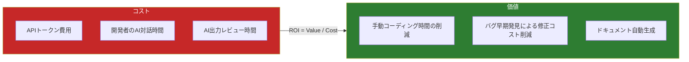

---

## 8. 指標の健全な範囲（ベンチマーク）

### 8.1 総合スコアカード

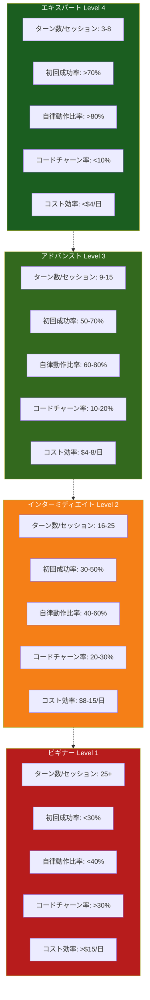

### 8.2 指標間の相関と解釈

| 状態パターン | ターン数 | トークン/ターン | 初回成功率 | 解釈 |
|-------------|---------|---------------|-----------|------|
| 熟練者の効率利用 | 少 (3-8) | 中 (2K-5K) | 高 (>60%) | 明確なプロンプト設計 |
| 対話的探索 | 中 (10-20) | 少 (<2K) | 中 (40-60%) | 段階的な対話で品質確保 |
| コンテキスト肥大 | 少 (3-5) | 多 (>10K) | 中 | ファイル読込過多、/clear不足 |
| 試行錯誤ループ | 多 (30+) | 中 | 低 (<30%) | タスク分割・プロンプト改善が必要 |
| AI過信 | 少 (1-3) | 多 | 不明 | レビュー不足のリスク |

---

## 9. 測定アーキテクチャ

### 9.1 Claude Code Activity Tracker との統合

本プロジェクト（Claude Code Activity Tracker）は既に Hook → API → DB の基盤を持つ。KPI 計測はこの基盤を拡張して実現する。

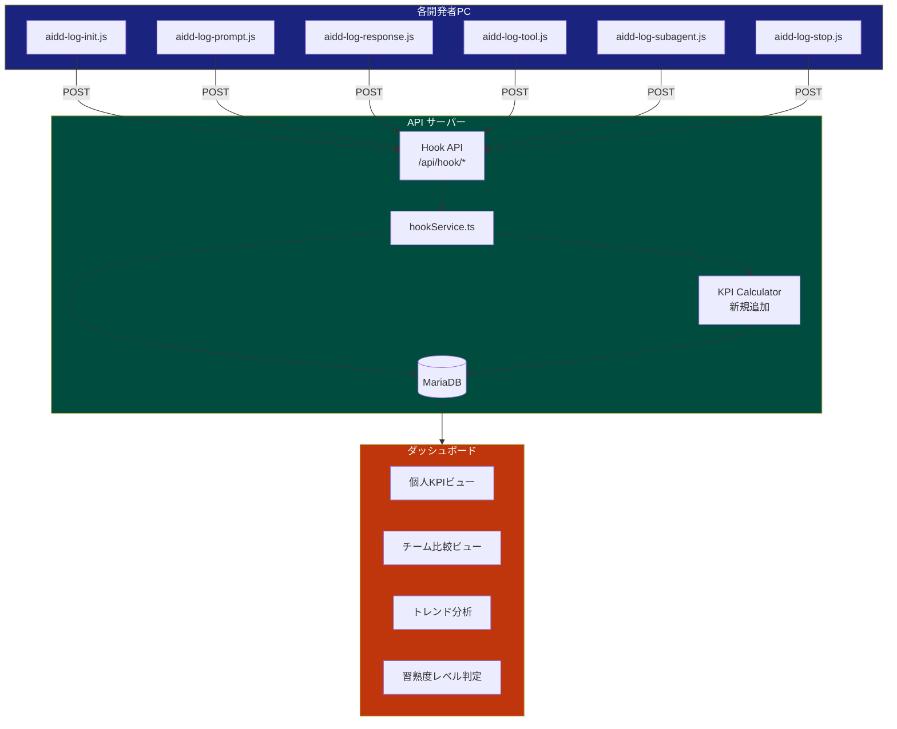

### 9.2 必要なデータソースと既存Hook対応

| KPI | データソース | 既存Hookでの取得可否 |
|-----|------------|-------------------|
| ターン数/セッション | stop hook: `num_turns` | 取得済み |
| トークン数/ターン | response hook: `usage` | 取得済み |
| セッション所要時間 | init/stop タイムスタンプ差分 | 取得済み |
| ツールコール数 | tool hook カウント | 取得済み |
| 初回成功率 | transcript解析（手戻りパターン検出） | 要拡張 |
| コードチャーン率 | Git diff + セッション紐付け | 要拡張 |
| 手戻り介入率 | prompt hook の修正指示パターン検出 | 要拡張 |
| 自律動作比率 | tool hook の連続実行ステップ分析 | 要拡張 |
| コスト/成果物 | token cost + Git commit 紐付け | 要拡張 |

### 9.3 新規テーブル設計案

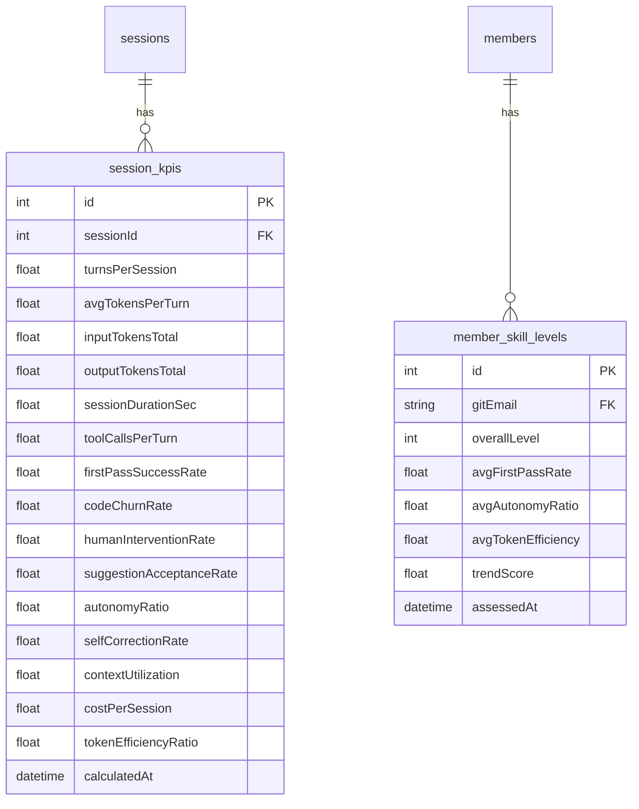

---

## 10. 段階的導入ロードマップ

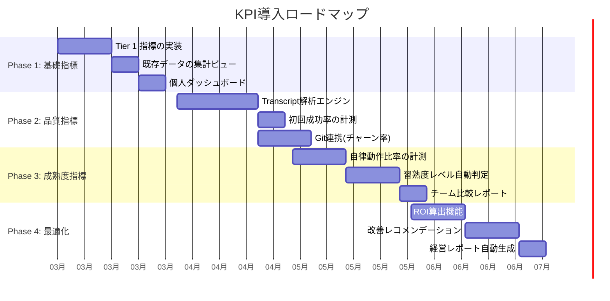

### フェーズ別の優先度

| Phase | 指標 | 難易度 | ビジネスインパクト |
|-------|------|--------|-----------------|
| 1 | ターン数、トークン数、セッション時間、ツールコール数 | 低（既存データ活用） | 中 |
| 2 | 初回成功率、コードチャーン率、手戻り率、採択率 | 中（解析ロジック追加） | 高 |
| 3 | 自律動作比率、自己修正率、コンテキスト活用効率 | 高（高度な分析） | 高 |
| 4 | コスト/成果物、トークン効率比、ROI | 中（外部データ連携） | 非常に高 |

---

## 11. 参考文献

### 学術研究・調査
- [METR: Measuring the Impact of Early-2025 AI on Experienced Open-Source Developer Productivity](https://metr.org/blog/2025-07-10-early-2025-ai-experienced-os-dev-study/) - AI利用で19%遅くなるというRCT研究
- [Intuition to Evidence: Measuring AI's True Impact on Developer Productivity (arXiv)](https://arxiv.org/pdf/2509.19708)
- [Measuring AI Agent Autonomy: Towards a Scalable Approach (arXiv)](https://arxiv.org/html/2502.15212v1)

### 業界レポート・ガイド
- [Jellyfish: 2025 AI Metrics in Review](https://jellyfish.co/blog/2025-ai-metrics-in-review/) - 組織のAI採用指標の年次レビュー
- [TechEmpower: AI Coding Tools Metrics](https://www.techempower.com/blog/2025/12/01/ai-coding-tools-metrics/)
- [Augment Code: Autonomous Development Metrics](https://www.augmentcode.com/tools/autonomous-development-metrics-kpis-that-matter-for-ai-assisted-engineering-teams)
- [Qodo: State of AI Code Quality in 2025](https://www.qodo.ai/reports/state-of-ai-code-quality/) - AI生成コードの76%が品質レッドゾーン
- [GitClear: AI Copilot Code Quality 2025](https://www.gitclear.com/ai_assistant_code_quality_2025_research) - コード重複4倍増加

### Claude Code 関連
- [Anthropic: Claude Code Monitoring Guide (GitHub)](https://github.com/anthropics/claude-code-monitoring-guide)
- [Claude Code Analytics API](https://docs.anthropic.com/en/api/claude-code-analytics-api)
- [Claude Code: Manage costs effectively](https://code.claude.com/docs/en/costs)
- [Tribe AI: Measuring Return on Claude Code Investment](https://www.tribe.ai/applied-ai/a-quickstart-for-measuring-the-return-on-your-claude-code-investment)
- [Faros AI: Claude Code Token Limits Guide](https://www.faros.ai/blog/claude-code-token-limits)

### 測定フレームワーク
- [DX: Measuring AI Code Assistants and Agents](https://getdx.com/research/measuring-ai-code-assistants-and-agents/)
- [Anthropic: Demystifying Evals for AI Agents](https://www.anthropic.com/engineering/demystifying-evals-for-ai-agents)
- [Galileo: AI Agent Metrics - A Deep Dive](https://galileo.ai/blog/ai-agent-metrics)
- [Google Cloud: KPIs for Gen AI](https://cloud.google.com/transform/gen-ai-kpis-measuring-ai-success-deep-dive)
- [Enreap: AI-Driven Developer Productivity in 2026](https://enreap.com/ai-driven-developer-productivity-in-2026-key-lessons-from-2025-for-engineering-leaders/)

---

> 本レポートは Claude Code Activity Tracker プロジェクトの拡張企画として作成されました。
> 既存の Hook 基盤を活用し、段階的にKPI測定機能を追加することを提案します。
