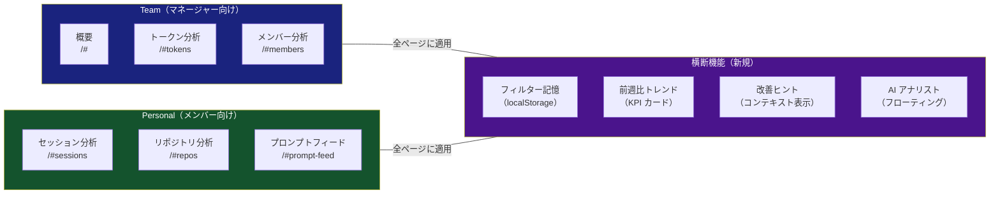
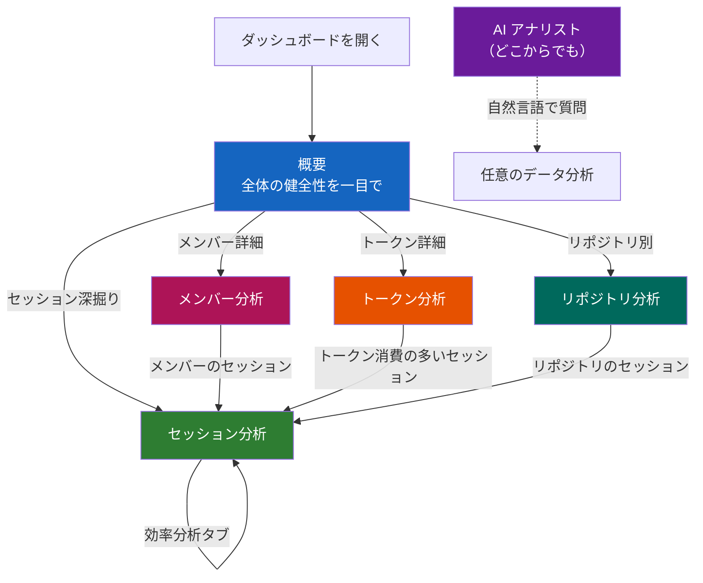
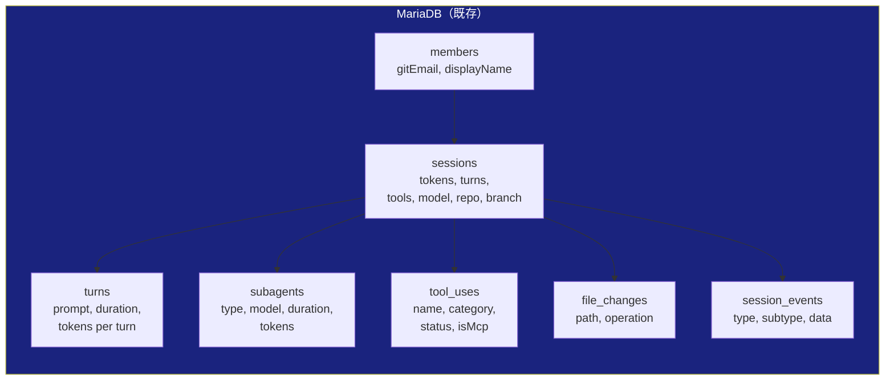
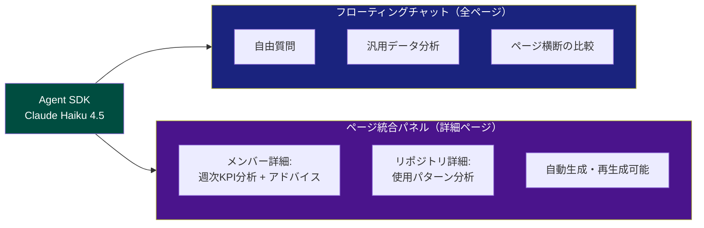
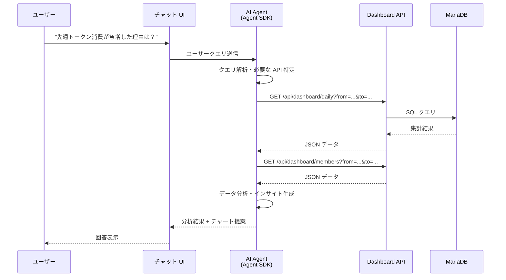
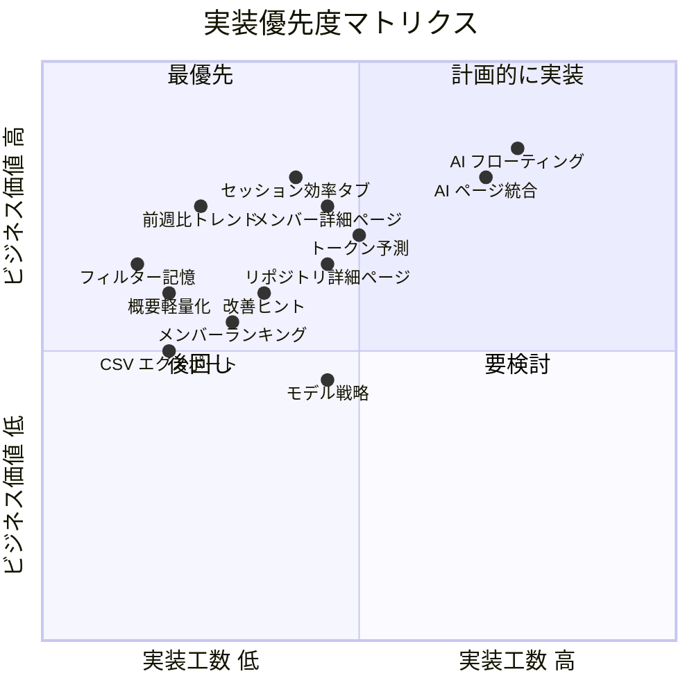
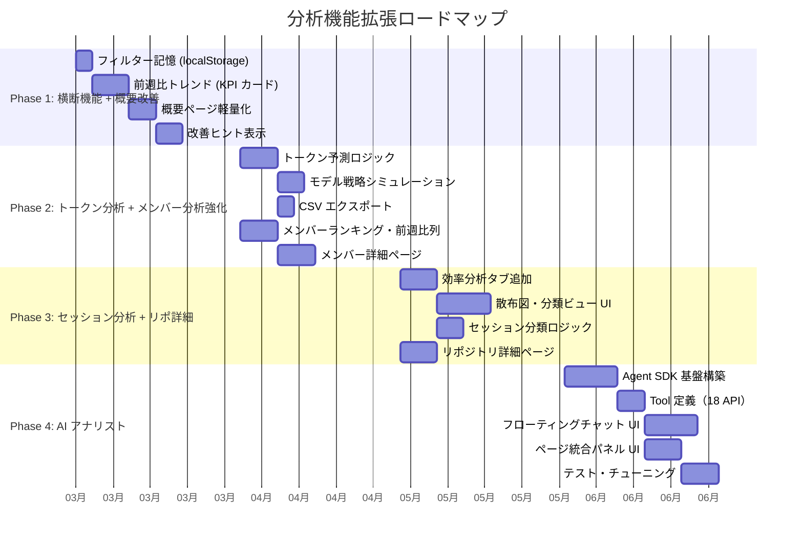

# ダッシュボード分析機能 拡張企画書

> **パンくず**: [README.md](../README.md) > [docs/](.) > **analytics-expansion-plan.md**

## 目次

- [エグゼクティブサマリー](#エグゼクティブサマリー)
- [現在のページ構成の課題と再構成案](#現在のページ構成の課題と再構成案)
- [現在のデータで実現可能な分析](#現在のデータで実現可能な分析)
- [各ページの拡張詳細](#各ページの拡張詳細)
- [Agent SDK AIアナリスト機能](#agent-sdk-aiアナリスト機能)
- [実装しないもの（データ不足）](#実装しないものデータ不足)
- [実装優先度と段階的ロードマップ](#実装優先度と段階的ロードマップ)

---

## エグゼクティブサマリー

本企画書は、Claude Code Activity Tracker の既存データ（7テーブル・18 API エンドポイント）を最大限に活用し、**追加のデータ収集なしに**実現可能な分析機能の拡張を提案する。

現在のダッシュボードは「全体概況の可視化」としては機能しているが、以下の点で開発者体験（DX）に改善の余地がある:

- 概要ページに情報が集中しすぎている（9 API 呼び出し）
- セッションの「効率」を分析する視点がない
- 前週比・トレンドなどの変化を把握できない
- 改善のための示唆（ヒント）がない

本企画では、以下の 3 軸で拡張を提案する:

1. **既存ページの再構成と強化** — 概要の軽量化、セッション効率分析タブの追加、各ページへのトレンド・ヒント機能の組み込み
2. **分析 KPI の追加** — 既存データから導出可能な KPI を Tier 1/2 に分類し、各ページに配置
3. **AI アナリスト** — Agent SDK を活用した自然言語分析のフローティングチャット UI

```mermaid
graph LR
    subgraph BEFORE["現在（6ページ）"]
        B1["概要<br/>（過負荷・9 API）"]
        B2["トークン利用分析"]
        B3[メンバー分析]
        B4[リポジトリ分析]
        B5["セッション履歴<br/>（一覧のみ）"]
        B6[プロンプトフィード]
    end

    subgraph AFTER["拡張後（6ページ + AI）"]
        A1["概要<br/>（軽量化・5 API）"]
        A2["トークン分析<br/>（モデル戦略・エクスポート追加）"]
        A3["メンバー分析<br/>（ランキング・トレンド追加）"]
        A4[リポジトリ分析]
        A5["セッション分析<br/>（効率分析タブ追加）"]
        A6[プロンプトフィード]
        A7["AI アナリスト<br/>（フローティング）"]
    end

    BEFORE --> AFTER

    style BEFORE fill:#1b4332,color:#fff
    style AFTER fill:#0f3460,color:#fff
```



---

## 現在のページ構成の課題と再構成案

### 現在の構成（6ページ）

```
サイドバー:
  概要ダッシュボード        /#
  トークン利用分析          /#tokens
  メンバー分析              /#members
  リポジトリ分析            /#repos
  セッション履歴            /#sessions
  プロンプトフィード        /#prompt-feed
```

### 課題分析

| # | 課題 | 影響 | 深刻度 |
|---|------|------|:------:|
| 1 | **概要ページの過負荷** — 1ページで 9 API を呼び出し、KPI + チャート 6種 + テーブルを表示 | 初期ロード遅延。情報の優先度が不明確 | 高 |
| 2 | **ページ間の役割重複** — 概要にメンバー別トークン Top5 があり、メンバー分析ページと重複 | 同じデータが2箇所で異なる見せ方をされる | 中 |
| 3 | **セッション履歴が一覧止まり** — セッションの効率性を比較・分類する視点がない | データはあるが、パターン発見や改善示唆に繋がらない | 高 |
| 4 | **トレンド不在** — 全ページで「現在の値」のみ表示。前週比・推移がわからない | 改善しているのか悪化しているのか判断できない | 高 |
| 5 | **改善示唆がない** — データを見せるだけで、どうすればいいかの提案がない | 数字は見えるがアクションに繋がらない | 中 |
| 6 | **フィルターが毎回リセット** — ページ遷移やリロードで選択が消える | 毎回同じメンバーやリポジトリを選び直す手間 | 中 |

### 再構成案

ページ数は増やさず、**既存6ページを強化**する方針。URL も変更しない。

**アクセス制限は設けない**（全ユーザーが全ページを閲覧可能）が、各ページは**ターゲットペルソナ**を明確にし、そのペルソナに最適化した UX を提供する。サイドバーではセクション見出し（TEAM / PERSONAL）でグルーピングする。



### ペルソナ別 UX 設計方針

| ペルソナ | ターゲットページ | UX の特徴 |
|---------|---------------|----------|
| **マネージャー** | 概要、トークン分析、メンバー分析 | チーム集計指標、トークン消費管理、メンバー間比較、コーチングヒント、採用促進のための活用度ゲージ |
| **メンバー** | セッション分析、リポジトリ分析、プロンプトフィード | 「My」で始まる個人指標、自己改善ヒント、チーム平均との比較、他メンバーからの学習 |

> **注**: マネージャーもセッション分析を使って自分のセッションを振り返れるし、メンバーも概要でチーム全体の状況を把握できる。ペルソナはあくまで「どちらの視点で UX を最適化するか」の設計指針。

### Before → After 対応表

| ページ | URL | ペルソナ | 変更内容 |
|--------|-----|:-------:|---------|
| 概要ダッシュボード | `/#` | Manager | **軽量化**。チーム健全性の俯瞰に特化。API 9→5 に削減 |
| トークン利用分析 | `/#tokens` | Manager | **改名: トークン分析**。トークン消費管理・モデル戦略・CSV エクスポート |
| メンバー分析 | `/#members` | Manager | **強化**。コーチングヒント・効率ランキング・前週比トレンド列 |
| - | `/#members/:id` | Manager | **新規: メンバー詳細**。週次KPIトレンド・AI分析パネル・セッション分類・ツール使用パターン |
| セッション履歴 | `/#sessions` | Member | **改名: セッション分析**。個人 KPI・効率分析タブ（散布図・分類）・自己改善ヒント |
| リポジトリ分析 | `/#repos` | Member | **強化**。「My Repos」個人指標・リポ一覧テーブル・フォーカスインサイト |
| - | `/#repos/:id` | Member | **新規: リポジトリ詳細**。AI分析パネル・コントリビューター内訳・ファイル変更パターン |
| プロンプトフィード | `/#prompt-feed` | Member | **強化**。学習ヒント・効率的なメンバーのプロンプト推薦 |
| - | - | Both | **新規: AI アナリスト（フローティング）** 全ページから利用可能な汎用チャット |
| - | - | Both | **新規: AI アナリスト（ページ統合）** 詳細ページに埋め込みの自動分析パネル |

### 横断機能: フィルター記憶

全ページ共通で、フィルター選択を localStorage に保存し、ページ遷移やリロード後も維持する。

| 動作 | 仕様 |
|------|------|
| フィルター変更時 | localStorage に `{member, repo, model, from, to}` を保存 |
| ページロード時 | localStorage から読み込んで復元。URL パラメータがあればそちらを優先 |
| リセットボタン | localStorage をクリアして全フィルターを初期値に戻す |

### 横断機能: 前週比トレンド

各ページの KPI カードに前週比（または前期比）を表示する。

```
+----------------------------+
| TOTAL TOKENS               |
| 5.6M                       |
| ▲ 12.5% vs 前週           |  ← 新規追加
+----------------------------+
```

| 計算ロジック | 説明 |
|-------------|------|
| 表示期間と同じ長さの前期間を自動算出 | 例: 直近 7 日なら前の 7 日間と比較 |
| 増減率 = `(今期 - 前期) / 前期 × 100` | 前期が 0 の場合は "NEW" と表示 |
| 色分け | 増加: 赤系（トークン消費）/ 緑系（セッション数）。指標の性質で判断 |

### 横断機能: 改善ヒント

データの傾向に基づくルールベースの提案を、関連するページにコンテキスト表示する。独立したページは設けない。

| 条件 | 表示メッセージ | 表示ページ |
|------|--------------|-----------|
| 平均ターン数 > 25 | "ターン数が多めです。タスクの分割や CLAUDE.md の整備を検討してください" | 概要, セッション分析 |
| Opus 利用率 > 80% | "Opus の利用率が高めです。定型作業には Sonnet/Haiku でトークン消費を最適化できます" | トークン分析 |
| エラー率 > 20% | "エラー率が高めです。プロンプトの具体性を上げるか permission mode を見直してください" | 概要, セッション分析 |
| サブエージェント利用 = 0 | "サブエージェント（Task ツール）を活用すると並列処理で効率が向上します" | セッション分析 |
| MCP ツール利用率 < 5% | "MCP ツールの活用が少なめです。プロジェクトに合った MCP サーバーの導入を検討してください" | 概要 |
| トークン消費が前週比 50%+ 増加 | "トークン消費が大幅に増加しています。モデル選択やセッション時間を確認してください" | 概要, トークン分析 |
| ターン効率が前週比で改善 | "ターン効率が改善傾向です" | 概要 |

```
+------------------------------------------------------------------+
| 💡 ヒント                                                         |
| Opus の利用率が 82% です。定型作業に Sonnet を使うと               |
| Sonnet への切り替えでトークン消費を最適化できます。 [トークン分析で詳しく見る →] |
+------------------------------------------------------------------+
```

### 概要ページの軽量化

概要ページは「全体の健全性を一目で把握する」役割に集中し、各ページと重複する詳細要素を委譲する。

**除去する要素**:

| 要素 | 理由 | 委譲先 |
|------|------|-------|
| メンバー別トークン Top5 横棒グラフ | メンバー分析と重複 | メンバー分析ページ |
| 生産性レーダーチャート | 各メンバーの詳細指標はメンバー分析に集約 | メンバー分析ページ |
| 最近のセッション テーブル | セッション分析と重複 | セッション分析ページ |

**軽量化後のレイアウト**:

```
+------------------------------------------------------------------+
| [KPI] 合計トークン(前週比) | アクティブ率 | セッション数 | キャッシュ効率 |
+------------------------------------------------------------------+
| [改善ヒント: 該当するものがあれば表示]                             |
+------------------------------------------------------------------+
| [日別トークン推移: 積み上げ棒]                                     |
+------------------------------------------------------------------+
| [ツール使用 Top10: 横棒]        | [時間帯ヒートマップ: 7×24]     |
+---------------------------------+---------------------------------+
| [セキュリティアラート（該当時のみ表示）]                           |
+------------------------------------------------------------------+
```

**効果**: API 呼び出し 9 → 5 に削減。ページロードが高速化し、情報の優先度が明確になる。

### ページ遷移フロー



---

## 現在のデータで実現可能な分析

### データソース一覧（既存7テーブル）



### Tier 1 KPI: 即時実装可能（既存データの集計のみ）

既存テーブルの単純な集計・グルーピングで算出可能な指標。

| # | KPI 名 | 計算式 | データソース | 表示ページ |
|---|--------|--------|-------------|-----------|
| 1 | **ターン効率** (Turns/Session) | `AVG(turn_count)` | sessions | 概要, セッション分析 |
| 2 | **トークン密度** (Tokens/Turn) | `SUM(input+output) / SUM(turn_count)` | sessions | トークン分析 |
| 3 | **平均レスポンス所要時間** | `AVG(SUM(turns.duration_ms))` per session | sessions, turns | 概要, セッション分析 |
| 4 | **ツール使用率** (Tools/Turn) | `SUM(tool_use_count) / SUM(turn_count)` | sessions | 概要 |
| 5 | **トークン/セッション** | `AVG(total_tokens)` | sessions | トークン分析 |
| 6 | **モデル選択比率** | `COUNT GROUP BY model` | sessions | トークン分析, メンバー分析 |
| 7 | **日別アクティブ率** | `COUNT DISTINCT date` per member | sessions | メンバー分析 |
| 8 | **サブエージェント活用率** | `AVG(subagent_count)` | sessions | セッション分析 |
| 9 | **エラー率** | `SUM(error_count) / SUM(turn_count)` | sessions | 概要, セッション分析 |
| 10 | **ツールカテゴリ分布** | `COUNT GROUP BY tool_category` | tool_uses | 概要 |
| 11 | **MCP ツール利用率** | `SUM(is_mcp=1) / COUNT(*)` | tool_uses | 概要 |
| 12 | **ファイル操作パターン** | `COUNT GROUP BY operation` | file_changes | セッション分析 |
| 13 | **リポジトリ集中度** | `COUNT GROUP BY git_repo` | sessions | リポジトリ分析 |
| 14 | **時間帯別活用パターン** | `COUNT GROUP BY HOUR(started_at)` | sessions | 概要 |
| 15 | **ブランチ多様性** | `COUNT DISTINCT git_branch` per repo | sessions | リポジトリ分析 |

> **所要時間の定義**: セッションの所要時間（Duration）は `ended_at - started_at`（セッション開始から終了までの経過時間）ではなく、**各ターンの `duration_ms`（プロンプト送信〜レスポンス受信）の合計**とする。これにより、ユーザーの思考時間や離席時間を除いた純粋な AI 応答時間を計測できる。
>
> **トークン表示形式**: セッションレベルのトークン表示は以下の3分割形式とする:
> ```
> ターンのトークン合計 / サブエージェントのトークン合計 / 総計
> 例: 512.3K / 84.5K / 596.8K
> ```
> これにより、サブエージェント利用の影響を一目で把握できる。

### Tier 2 KPI: 軽微なロジック追加で実現可能

既存データの組み合わせ・派生計算で算出可能だが、新規の集計クエリや比較ロジックが必要な指標。

| # | KPI 名 | 計算ロジック | 必要な追加実装 | 表示ページ |
|---|--------|------------|--------------|-----------|
| 1 | **前週比トレンド** | 各 Tier 1 指標の前期間比較 | 期間比較クエリ | 全ページ KPI カード |
| 2 | **セッション効率スコア** | `(turn_count × tools) / total_tokens` の正規化 | スコアリング関数 | セッション分析 |
| 3 | **メンバー間効率比較** | 各指標を標準偏差ベースでランキング | 統計処理 | メンバー分析 |
| 4 | **トークン予測（線形回帰）** | 直近 N 日の日別トークン消費から月末を外挿 | 予測ロジック | トークン分析 |
| 5 | **ツール成功率** | `status='success' / total` per tool | 集計クエリ | 概要 |
| 6 | **セッション分類** | ターン数 × 時間でセッションを類型化 | 分類ロジック | セッション分析 |
| 7 | **ファイル影響範囲** | 1セッションで変更したファイル数・ディレクトリ分散度 | 集計クエリ | セッション分析 |
| 8 | **サブエージェント効率** | トークン対時間効率（tokens/duration） | 集計クエリ | セッション分析 |
| 9 | **モデル最適性スコア** | ツール使用パターンとモデル選択の相関 | 分析ロジック | トークン分析 |
| 10 | **ターン応答時間分析** | `AVG(duration_ms)` の分布・外れ値検出 | 統計処理 | セッション分析 |

---

## 各ページの拡張詳細

### 概要ダッシュボード `/#`（Manager 向け: 軽量化 + ヒント追加）

**変更方針**: マネージャーが「チーム全体の健全性を一目で確認 → 各ページへドリルダウン」する起点に特化する。情報過多を解消。

**除去する要素と委譲先**:

| 要素 | 委譲先 |
|------|-------|
| メンバー別トークン Top5 横棒グラフ | メンバー分析 |
| 生産性レーダーチャート | メンバー分析 |
| 最近のセッション テーブル | セッション分析 |

**追加する要素**:

| 要素 | 内容 |
|------|------|
| KPI カードに前週比 | 各 KPI に `▲ 12.5% vs 前週` を追加 |
| 改善ヒント | 条件に合致するヒントをカード上部に表示 |

**API 呼び出し変更**: 9 → 5（stats, daily, tools, heatmap, security）

### トークン分析 `/#tokens`（Manager 向け: トークン消費管理 + モデル最適化）

**変更方針**: モデル別トークン消費の追跡と最適化戦略。ラベルを「トークン分析」に変更し、トークン予測・モデル戦略・エクスポート機能を追加。

**追加する要素**:

| 要素 | 内容 |
|------|------|
| トークン予測チャート | 日別トークン推移チャートに、直近 N 日の線形回帰による月末予測ラインを重ねて表示 |
| モデル戦略セクション | モデル比率の変更がトークン消費に与える影響のシミュレーション |
| CSV エクスポートボタン | メンバー別・日別のトークンデータを CSV ダウンロード |
| 改善ヒント | Opus 比率が高い場合の最適化提案など |

**レイアウト**:

```
+------------------------------------------------------------------+
| [KPI] 合計トークン(前週比) | 月末予測 | サブエージェント% | トークン/Session |
+------------------------------------------------------------------+
| [改善ヒント: 該当時のみ]                              [CSV ▼]    |
+------------------------------------------------------------------+
| [日別トークン推移 + 予測ライン（モデル別積み上げ棒 + 回帰線）]    |
+------------------------------------------------------------------+
| [モデル別トークン内訳: ドーナツ]  | [モデル比率シミュレーション]  |
+---------------------------------+---------------------------------+
| [トークン種別内訳: ドーナツ]     | [メンバー別トークン: 横棒]    |
+---------------------------------+---------------------------------+
| [メンバー別トークン消費量テーブル]                                 |
+------------------------------------------------------------------+
```

### メンバー分析 `/#members`（Manager 向け: コーチング + ランキング）

**変更方針**: マネージャーがチーム育成に活用。メンバー間の比較・トレンドを強化し、コーチング機会を示唆するヒントを追加。

**追加する要素**:

| 要素 | 内容 | 配置 |
|------|------|------|
| 効率ランキング KPI | ターン効率・トークン効率の上位メンバー | ヒートマップの上に KPI カード形式 |
| 活用度ゲージ | アクティブメンバー数 / 全メンバー数 | KPI カードとして追加 |
| コーチングヒント | 活用度低下・効率低下メンバーへのアクション提案 | KPI カード下にヒントカード |
| ベストプラクティス共有 | 高効率メンバーのパターンをチームに展開する提案 | ヒントカード |
| 前週比列 | 各メンバーのトークン・セッション数の前週比 | テーブルに列追加（▲▼ 表示） |
| 生産性レーダー | 概要から移動。メンバー詳細パネル内で表示 | メンバー詳細（右パネル） |

**レイアウト変更**:

```
+------------------------------------------------------------------+
| [KPI] アクティブ率 | 効率 Top: ○○ | トークン Top: △△ | 合計トークン |
+------------------------------------------------------------------+
| [コーチングヒント: 活用度低下メンバーへの提案]                     |
| [ベストプラクティス: 高効率メンバーのパターン共有提案]             |
+------------------------------------------------------------------+
| メンバー一覧テーブル + 前週比 ▲▼ 列                               |
| クリック → メンバー詳細ページへドリルダウン                        |
+------------------------------------------------------------------+
```

### メンバー詳細ページ `/#members/:id`（新規）

**概要**: メンバー一覧テーブルのクリックで遷移する詳細ページ。マネージャーが個人のパフォーマンスを深掘りし、AI による週次分析を確認できる。

**レイアウト**:

```
+------------------------------------------------------------------+
| パンくず: Member Analysis / t.hirai                               |
| [アバター] t.hirai — 48 sessions in last 30 days, Rank #2        |
+------------------------------------------------------------------+
| [KPI] Sessions | Avg Turns | Total Tokens | Efficiency Score      |
+------------------------------------------------------------------+
| [AI Weekly Analysis] ← Agent SDK による自動分析                   |
| 週1-4のKPI推移と傾向分析、具体的セッションに基づくアドバイス      |
| [Regenerate] [Compare with Team] [Export as Report]               |
+------------------------------------------------------------------+
| [週次KPIトレンドチャート]     | [モデル使用ドーナツ]             |
+---------------------------------+---------------------------------+
| [セッション分類カード: Quick Fix 35% | Focused 33% | ...]        |
+------------------------------------------------------------------+
| [ツール使用パターン: 横棒]                                        |
+------------------------------------------------------------------+
| [最近のセッション: テーブル]                                       |
+------------------------------------------------------------------+
```

**AI Weekly Analysis パネル**:

ページに統合された AI 分析パネル。フローティングチャットとは異なり、**ページコンテキストに特化した自動分析**を提供する。

| 要素 | 内容 |
|------|------|
| 週次KPI推移 | 直近4週間のセッション数・平均ターン・トークン消費の変化を列挙 |
| 傾向分析 | 改善 / 悪化のパターンを特定し理由を推測 |
| 具体的アドバイス | 実際のセッションデータに基づく改善提案（例: CLAUDE.md 更新、Task ツール活用） |
| アクションボタン | 再生成、チーム比較、レポートエクスポート |

### セッション分析 `/#sessions`（Member 向け: 個人効率 + 自己改善）

**変更方針**: メンバーが自分のセッションを振り返り、効率改善のアクションを得られるようにする。個人 KPI カード（My Sessions, My Avg Turns, My Tokens, Efficiency Score）とチーム平均との比較を追加。効率分析タブでパターン発見。

**タブ構成**:

| タブ | 内容 | 備考 |
|------|------|------|
| **My Sessions** | セッション一覧。トークン列は Turn/Sub/Total 形式、Duration 列はレスポンス時間合計 | 既存機能ベース。タブ名変更 |
| **効率分析** | セッション散布図 + 分類サマリー + パターン分析 | 新規追加 |

**個人 KPI カード（タブ上部に表示）**:

| KPI | 内容 | 比較対象 |
|-----|------|---------|
| My Sessions | 自分のセッション数（前週比付き） | - |
| My Avg Turns | 自分の平均ターン数 | チーム平均との比較表示 |
| My Tokens | 自分のトークン消費（前週比付き） | チーム全体に対する % |
| Efficiency Score | トークン/ターン正規化スコア | 前期比ポイント差 |

**効率分析タブのレイアウト**:

```
+------------------------------------------------------------------+
| [散布図] X=ターン数, Y=トークン消費                                 |
|   色=モデル(Opus/Sonnet/Haiku), サイズ=セッション時間              |
|   クリック → 一覧タブのセッション詳細を表示                        |
+------------------------------------------------------------------+
| [分類サマリー]                                                     |
| Quick Fix: 45%  |  Focused: 30%  |  Explore: 15%  |  Heavy: 10% |
+------------------------------------------------------------------+
| [分類別ツールカテゴリ分布: 積み上げ横棒]                           |
+------------------------------------------------------------------+
| [改善ヒント: 該当時のみ]                                           |
+------------------------------------------------------------------+
```

**セッション分類の基準**:

| 分類 | ターン数 | ツール使用/ターン | トークン | 典型的な用途 |
|------|---------|----------------|---------|------------|
| Quick Fix | 1-5 | < 2 | < 15K | バグ修正、小さな変更 |
| Focused Build | 5-15 | 3-8 | 15K-100K | 機能実装、リファクタリング |
| Exploration | 15-30 | 1-3 | 100K-300K | 調査、設計検討 |
| Heavy Session | 30+ | 5+ | 300K+ | 大規模実装、複雑なデバッグ |

**散布図のインタラクション**:

| 操作 | 動作 |
|------|------|
| ポイントにホバー | ツールチップでセッション概要（メンバー、リポジトリ、時間）を表示 |
| ポイントをクリック | 一覧タブに切り替えて該当セッションの詳細パネルを開く |
| 分類ラベルをクリック | 散布図を該当分類でフィルタリング |
| フィルター変更 | サイドバーのフィルターに連動して散布図を更新 |

### リポジトリ分析 `/#repos`（Member 向け: 個人活動 + リポ詳細）

**変更方針**: メンバーが自分のリポジトリ活動を把握できる個人指標（My Repositories）を追加。リポジトリ一覧テーブルのクリックで詳細ページに遷移。

**追加する要素**:

| 要素 | 内容 | 配置 |
|------|------|------|
| 個人 KPI カード | My Repositories / My Sessions / My Tokens / サブエージェント比率 | ページ上部 |
| フォーカスインサイト | リポジトリ間のトークン配分ヒント | ヒントカード |
| リポジトリ一覧テーブル | Sessions, Trend, Contributors, Tokens, Tokens/Session | クリックで詳細へ |

### リポジトリ詳細ページ `/#repos/:id`（新規）

**概要**: リポジトリ一覧テーブルのクリックで遷移する詳細ページ。AI によるリポジトリ使用パターン分析を含む。

**レイアウト**:

```
+------------------------------------------------------------------+
| パンくず: Repository Analysis / claude-activity-tracker           |
| claude-activity-tracker — 62 sessions from 3 contributors        |
+------------------------------------------------------------------+
| [KPI] Sessions | Contributors | Total Tokens | Branches            |
+------------------------------------------------------------------+
| [AI Repository Analysis] ← Agent SDK による自動分析              |
| トークン集中、効率ギャップ、ブランチ活動、ツールパターン          |
| [Regenerate] [Compare with Other Repos] [View Branch Breakdown]  |
+------------------------------------------------------------------+
| [日別アクティビティチャート]  | [コントリビューター内訳: 横棒]  |
+---------------------------------+---------------------------------+
| [最も変更されたファイル: テーブル]                                 |
+------------------------------------------------------------------+
| [最近のセッション: テーブル（ブランチ列付き）]                     |
+------------------------------------------------------------------+
```

**AI Repository Analysis パネル**:

| 要素 | 内容 |
|------|------|
| トークン集中 | 最もトークン消費の多いメンバー・ブランチを特定 |
| 効率ギャップ | メンバー間のターン効率差を分析 |
| ブランチ活動 | 最もアクティブなブランチとタスク分解の提案 |
| ツールパターン | Read/Edit比率からコード探索量を推定し、CLAUDE.md 最適化を提案 |

### プロンプトフィード `/#prompt-feed`（Member 向け: 学習 + 共有）

**変更方針**: メンバーが他メンバーのプロンプトから学び、自身のプロンプト品質を向上させる。

**追加する要素**:

| 要素 | 内容 | 配置 |
|------|------|------|
| 学習ヒント | 効率的なセッションのプロンプトパターンを解説 | フィード上部にヒントカード |
| プロンプト推薦 | 高効率メンバーのプロンプトを「おすすめ」としてハイライト | フィード内にバッジ表示 |

---

## Agent SDK AIアナリスト機能

### 概要

AI アナリストは**2つの形態**でダッシュボードに統合する:

1. **フローティングチャット** — 全ページ共通。右下のボタンから開き、自由な質問を投げかける汎用分析ツール
2. **ページ統合パネル** — 詳細ページ（メンバー詳細、リポジトリ詳細）に埋め込み。ページコンテキストに特化した自動分析を提供



### フローティングチャット

ダッシュボード右下にフローティングチャットボタンを設置し、Anthropic Agent SDK（TypeScript）を利用して自然言語でデータ分析を行える。どのページからでも利用可能。



### Agent SDK 構成案

```mermaid
graph LR
    subgraph AGENT["AI Agent"]
        T1["Tool: fetch_stats<br/>GET /api/dashboard/stats"]
        T2["Tool: fetch_daily<br/>GET /api/dashboard/daily"]
        T3["Tool: fetch_members<br/>GET /api/dashboard/members"]
        T4["Tool: fetch_sessions<br/>GET /api/dashboard/sessions"]
        T5["Tool: fetch_tools<br/>GET /api/dashboard/tools"]
        T6["Tool: fetch_tokens<br/>GET /api/dashboard/tokens"]
    end

    subgraph PROMPT["System Prompt"]
        SP1["役割: データアナリスト"]
        SP2["DB スキーマの知識"]
        SP3["KPI の定義・解釈方法"]
        SP4["分析の指針"]
    end

    PROMPT --> AGENT

    style AGENT fill:#1a237e,color:#fff
    style PROMPT fill:#004d40,color:#fff
```



### 想定される質問と対応

| 質問カテゴリ | 質問例 | 使用する API | 分析内容 |
|-------------|-------|-------------|---------|
| トークン分析 | "今月のトークン消費量は？" | stats, tokens | トークン集計 + 予測 |
| メンバー比較 | "最も効率的なメンバーは？" | members, sessions | 効率指標ランキング |
| トレンド | "ツール使用の傾向は？" | tools, daily | 時系列変化の分析 |
| 異常検知 | "先週と比べて異常は？" | daily, members | 前週比の外れ値検出 |
| 最適化提案 | "トークン最適化の方法は？" | tokens, members, tools | モデル選択・パターン分析 |
| セッション分析 | "長時間セッションの原因は？" | sessions | セッション特性の深掘り |

### ページ統合パネル

詳細ページ（メンバー詳細、リポジトリ詳細）に埋め込まれた AI 分析パネル。フローティングチャットとは異なり、**ページコンテキストに特化した自動分析**を提供する。

| 統合先 | 分析内容 | トリガー |
|--------|---------|---------|
| **メンバー詳細** | 週次 KPI 推移分析、実セッションに基づくアドバイス、改善パターン特定 | ページ表示時に自動実行 |
| **リポジトリ詳細** | トークン集中箇所、効率ギャップ、ブランチ活動、ツールパターン分析 | ページ表示時に自動実行 |

**UI コンポーネント: `ai-insight` パネル**:

```
+------------------------------------------------------------------+
| [AI Weekly Analysis]                           [Agent SDK badge]  |
+------------------------------------------------------------------+
| 分析結果テキスト（週次推移、傾向、アドバイス）                     |
+------------------------------------------------------------------+
| [Regenerate] [Compare with Team] [Export as Report]               |
+------------------------------------------------------------------+
```

**フローティングチャットとの違い**:

| 特性 | フローティングチャット | ページ統合パネル |
|------|---------------------|----------------|
| 表示場所 | 全ページ右下（オーバーレイ） | 詳細ページ内（インライン） |
| トリガー | ユーザーが明示的に開く | ページ表示時に自動生成 |
| コンテキスト | 汎用（ユーザーの質問に依存） | ページ固定（メンバーID or リポID） |
| インタラクション | 会話形式（質問→回答→質問...） | 生成→再生成ボタン |
| 用途 | 「なぜトークンが増えた？」「比較して」 | 「この人の週次傾向は？」「このリポの問題は？」 |

### 実装方針

| 項目 | 方針 |
|------|------|
| SDK | `@anthropic-ai/agent-sdk`（TypeScript） |
| モデル | Claude Haiku 4.5（軽量・高速応答） |
| Tool 定義 | 既存の 18 Dashboard API エンドポイントをそのまま Tool として登録 |
| UI (フローティング) | ダッシュボード右下にフローティングチャットパネル |
| UI (統合) | `.ai-insight` パネルを詳細ページに埋め込み |
| 認証 | ダッシュボードと同じ API キーを使用 |
| トークン制御 | 1クエリあたりの max_tokens 制限、1日のクエリ数上限 |
| ストリーミング | Agent SDK のストリーミング機能で逐次表示 |
| キャッシュ | 統合パネルの分析結果を sessionStorage にキャッシュ（5分間有効） |

---

## 実装しないもの（データ不足）

以下の指標・機能は、**現在の Hook / DB 構造では必要なデータが取得できない**ため、本拡張の対象外とする。実現にはフックの拡張や外部データ連携が必要。

| 指標 / 機能 | 不足しているデータ | 実現に必要な追加対応 |
|-------------|-----------------|-------------------|
| **初回成功率** | AI の提案に対するユーザーの承認/拒否記録 | Hook で permission 応答を記録するか、transcript の詳細解析が必要 |
| **コードチャーン率** | セッション後の Git diff（72h 以内の変更） | Git 連携フック or 定期バッチで diff を取得 |
| **手戻り介入率** | ユーザープロンプトの意図分類（修正指示 vs 新規指示） | NLP による prompt 分類、または transcript 解析 |
| **提案採択率** | ツール実行の許可/拒否イベント | Claude Code の permission 応答を Hook で取得 |
| **自律動作比率** | ターン内の連続ステップ数（人間介入なし） | transcript の詳細解析が必要 |
| **自己修正率** | AI が自発的にエラーを修正したイベント | transcript 解析 + パターンマッチング |
| **コンテキスト活用効率** | コンテキストウィンドウ使用率 | API レベルの使用量データが必要 |
| **成果物あたりトークン** | セッションと Git commit / PR の紐付け | Git 連携が必要（commit hash, PR ID） |
| **コード品質スコア** | 静的解析結果、テスト結果 | CI/CD 連携が必要 |
| **ユーザー満足度** | セッション後の主観評価 | 評価 UI の追加が必要 |

> これらの指標は [docs/ai-productivity-kpi-report.md](ai-productivity-kpi-report.md) で詳細に定義されている。将来的にフック拡張と合わせて段階的に対応する。

---

## 実装優先度と段階的ロードマップ

### 優先度マトリクス



### 段階的ロードマップ



### Phase 別サマリー

| Phase | 内容 | 主な変更 | 技術的難易度 |
|-------|------|---------|------------|
| **Phase 1** | 横断機能 + 概要改善 | localStorage、前週比クエリ、概要の要素移動、ヒント表示 | 低 |
| **Phase 2** | トークン分析 + メンバー分析強化 | 予測ロジック、CSV、ランキング、**メンバー詳細ページ** | 中 |
| **Phase 3** | セッション分析 + リポ詳細 | 効率分析タブ、散布図、分類ロジック、**リポジトリ詳細ページ** | 中 |
| **Phase 4** | AI アナリスト | フローティングチャット + **ページ統合パネル** + Agent SDK | 高 |

### 前提条件

| 項目 | 条件 |
|------|------|
| 既存 DB | スキーマ変更なし（既存7テーブルのみ使用） |
| 既存 API | 既存 18 エンドポイントはそのまま維持 |
| 既存 URL | ハッシュルーティングは一切変更しない |
| フロントエンド | 既存の EJS + Chart.js アーキテクチャを踏襲 |
| Agent SDK | Phase 4 のみ。Anthropic API キーの追加設定が必要 |

---

## 参考文献

- [docs/ai-productivity-kpi-report.md](ai-productivity-kpi-report.md) - AI駆動開発 生産性KPI企画書（KPI 定義の詳細）
- [docs/dashboard-design.md](dashboard-design.md) - 現行ダッシュボード設計
- [docs/database-design.md](database-design.md) - DB スキーマ詳細
- [Anthropic Agent SDK (GitHub)](https://github.com/anthropics/agent-sdk) - Agent SDK リポジトリ
