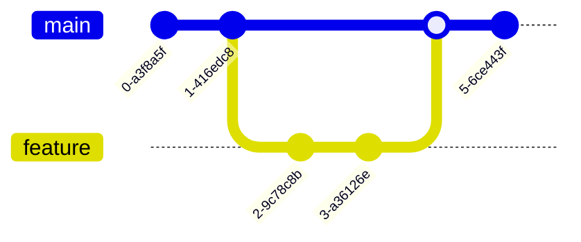

# GitHub Markdown 拡張機能 完全ガイド

> **パンくず**: [README.md](../README.md) > [CLAUDE.md](../CLAUDE.md) > **github-markdown-extended-features.md**

標準 Markdown 以外で GitHub の `.md` ファイルに表示できる全機能のリファレンス。

## 目次

- [1. Mermaid ダイアグラム](#1-mermaid-ダイアグラム)
- [2. GeoJSON / TopoJSON マップ](#2-geojson--topojson-マップ)
- [3. STL 3D モデル](#3-stl-3d-モデル)
- [4. 数式 (LaTeX / MathJax)](#4-数式-latex--mathjax)
- [5. アラート / Admonitions](#5-アラート--admonitions)
- [6. 脚注 (Footnotes)](#6-脚注-footnotes)
- [7. タスクリスト](#7-タスクリスト)
- [8. テーブル (GFM 拡張)](#8-テーブル-gfm-拡張)
- [9. 折りたたみセクション](#9-折りたたみセクション)
- [10. 絵文字ショートコード](#10-絵文字ショートコード)
- [11. 自動リンク参照](#11-自動リンク参照)
- [12. シンタックスハイライト](#12-シンタックスハイライト)
- [13. 画像テーマ (ライト/ダークモード)](#13-画像テーマ-ライトダークモード)
- [14. 相対リンク・セクションリンク](#14-相対リンクセクションリンク)
- [15. 取り消し線](#15-取り消し線)
- [16. 下付き・上付き文字](#16-下付き上付き文字)
- [17. キーボードタグ](#17-キーボードタグ)
- [18. HTML コメント (非表示テキスト)](#18-html-コメント-非表示テキスト)
- [19. 動画埋め込み](#19-動画埋め込み)
- [20. カラープレビュー](#20-カラープレビュー)
- [21. CSV / TSV レンダリング](#21-csv--tsv-レンダリング)
- [22. その他の GFM 機能](#22-その他の-gfm-機能)
- [まとめ](#まとめ)

---

## 1. Mermaid ダイアグラム

テキストベースのダイアグラムを直接レンダリングできる。

### フローチャート


### シーケンス図


### クラス図


### 状態遷移図


### ER 図


### ガントチャート


### 円グラフ


### Git グラフ



### ユーザージャーニー


---

## 2. GeoJSON / TopoJSON マップ

地理データをインタラクティブなマップとして表示。

### GeoJSON

```geojson
{
  "type": "FeatureCollection",
  "features": [
    {
      "type": "Feature",
      "properties": {
        "name": "東京タワー"
      },
      "geometry": {
        "type": "Point",
        "coordinates": [139.7454, 35.6586]
      }
    },
    {
      "type": "Feature",
      "properties": {
        "name": "東京エリア"
      },
      "geometry": {
        "type": "Polygon",
        "coordinates": [[
          [139.70, 35.65],
          [139.80, 35.65],
          [139.80, 35.70],
          [139.70, 35.70],
          [139.70, 35.65]
        ]]
      }
    }
  ]
}
```

### TopoJSON

```topojson
{
  "type": "Topology",
  "objects": {
    "example": {
      "type": "GeometryCollection",
      "geometries": [
        {
          "type": "Point",
          "coordinates": [139.6917, 35.6895],
          "properties": {"name": "新宿"}
        }
      ]
    }
  }
}
```

---

## 3. STL 3D モデル

ASCII STL 形式の 3D モデルをインタラクティブに表示。

```stl
solid cube
  facet normal 0 0 -1
    outer loop
      vertex 0 0 0
      vertex 1 0 0
      vertex 1 1 0
    endloop
  endfacet
  facet normal 0 0 -1
    outer loop
      vertex 0 0 0
      vertex 1 1 0
      vertex 0 1 0
    endloop
  endfacet
  facet normal 0 0 1
    outer loop
      vertex 0 0 1
      vertex 1 1 1
      vertex 1 0 1
    endloop
  endfacet
  facet normal 0 0 1
    outer loop
      vertex 0 0 1
      vertex 0 1 1
      vertex 1 1 1
    endloop
  endfacet
  facet normal 0 -1 0
    outer loop
      vertex 0 0 0
      vertex 1 0 1
      vertex 1 0 0
    endloop
  endfacet
  facet normal 0 -1 0
    outer loop
      vertex 0 0 0
      vertex 0 0 1
      vertex 1 0 1
    endloop
  endfacet
  facet normal 1 0 0
    outer loop
      vertex 1 0 0
      vertex 1 0 1
      vertex 1 1 1
    endloop
  endfacet
  facet normal 1 0 0
    outer loop
      vertex 1 0 0
      vertex 1 1 1
      vertex 1 1 0
    endloop
  endfacet
  facet normal 0 1 0
    outer loop
      vertex 0 1 0
      vertex 1 1 0
      vertex 1 1 1
    endloop
  endfacet
  facet normal 0 1 0
    outer loop
      vertex 0 1 0
      vertex 1 1 1
      vertex 0 1 1
    endloop
  endfacet
  facet normal -1 0 0
    outer loop
      vertex 0 0 0
      vertex 0 1 0
      vertex 0 1 1
    endloop
  endfacet
  facet normal -1 0 0
    outer loop
      vertex 0 0 0
      vertex 0 1 1
      vertex 0 0 1
    endloop
  endfacet
endsolid cube
```

---

## 4. 数式 (LaTeX / MathJax)

### インライン数式

質量とエネルギーの等価性: $E = mc^2$

二次方程式の解: $x = \frac{-b \pm \sqrt{b^2 - 4ac}}{2a}$

### ブロック数式

$$
\int_{-\infty}^{\infty} e^{-x^2} dx = \sqrt{\pi}
$$

$$
\sum_{n=1}^{\infty} \frac{1}{n^2} = \frac{\pi^2}{6}
$$

$$
\nabla \times \mathbf{E} = -\frac{\partial \mathbf{B}}{\partial t}
$$

### math コードブロック記法

```math
\begin{bmatrix}
a & b \\
c & d
\end{bmatrix}
\begin{bmatrix}
x \\
y
\end{bmatrix}
=
\begin{bmatrix}
ax + by \\
cx + dy
\end{bmatrix}
```

---

## 5. アラート / Admonitions

5 種類のアラートブロックが使用可能。

> [!NOTE]
> 補足情報。スキミング中でもユーザーが知っておくべき有用な情報。

> [!TIP]
> ヒント。物事をより良くまたはより簡単に行うための役立つアドバイス。

> [!IMPORTANT]
> 重要。目標を達成するためにユーザーが知る必要がある重要な情報。

> [!WARNING]
> 警告。問題を回避するためにユーザーが即座に注意を払う必要がある緊急情報。

> [!CAUTION]
> 注意。特定のアクションの潜在的なリスクや否定的な結果についてのアドバイス。

---

## 6. 脚注 (Footnotes)

GitHub Flavored Markdown は脚注をサポートしている[^1]。

脚注は複数行にもできる[^long-note]。

数字以外の識別子も使用可能[^note-id]。

[^1]: これは単純な脚注。
[^long-note]: 複数行の脚注は、追加行を 4 スペースでインデントする。

    このように 2 行目以降を記述できる。
[^note-id]: 識別子にはスペースやタブは使用不可。

---

## 7. タスクリスト

- [x] 要件定義完了
- [x] 基本設計完了
- [ ] 詳細設計
- [ ] 実装
  - [x] バックエンド API
  - [ ] フロントエンド UI
  - [ ] テスト
- [ ] デプロイ

> **Note**: Issues / PR ではチェックボックスがインタラクティブに動作する。README では表示のみ。

---

## 8. テーブル (GFM 拡張)

### 基本テーブル

| 機能 | 対応状況 | 備考 |
|------|:--------:|------|
| Mermaid | :white_check_mark: | 10種類のダイアグラム |
| GeoJSON | :white_check_mark: | インタラクティブマップ |
| 数式 | :white_check_mark: | MathJax ベース |
| アラート | :white_check_mark: | 5種類 |

### アラインメント

| 左寄せ | 中央寄せ | 右寄せ |
|:-------|:--------:|-------:|
| text   | text     | text   |
| left   | center   | right  |

### テーブル内の書式

| 書式 | 構文 | 結果 |
|------|------|------|
| 太字 | `**bold**` | **bold** |
| 斜体 | `*italic*` | *italic* |
| コード | `` `code` `` | `code` |
| リンク | `[link](url)` | [GitHub](https://github.com) |
| 取り消し | `~~text~~` | ~~text~~ |

---

## 9. 折りたたみセクション

<details>
<summary>クリックして展開: 基本的な折りたたみ</summary>

ここに隠れたコンテンツを記述できる。

- Markdown の書式がそのまま使える
- リスト、コードブロック、画像なども OK

```python
print("コードブロックも折りたたみの中に書ける")
```

</details>

<details>
<summary>ネストされた折りたたみ</summary>

外側のコンテンツ。

<details>
<summary>さらに内側の折りたたみ</summary>

内側のコンテンツ。入れ子にできる。

</details>

</details>

<details open>
<summary>デフォルトで展開済み (open 属性)</summary>

`<details open>` を使うと、最初から展開された状態で表示される。

</details>

---

## 10. 絵文字ショートコード

### よく使うショートコード

| ショートコード | 表示 | 用途 |
|---------------|------|------|
| `:rocket:` | :rocket: | リリース・デプロイ |
| `:bug:` | :bug: | バグ |
| `:sparkles:` | :sparkles: | 新機能 |
| `:memo:` | :memo: | ドキュメント |
| `:wrench:` | :wrench: | 設定・ツール |
| `:white_check_mark:` | :white_check_mark: | 完了・成功 |
| `:warning:` | :warning: | 警告 |
| `:x:` | :x: | エラー・失敗 |
| `:bulb:` | :bulb: | アイデア |
| `:lock:` | :lock: | セキュリティ |
| `:zap:` | :zap: | パフォーマンス |
| `:recycle:` | :recycle: | リファクタリング |
| `:fire:` | :fire: | 削除 |
| `:tada:` | :tada: | お祝い |
| `:construction:` | :construction: | WIP |

> GitHub は 1,500 以上のショートコードに対応。全一覧: https://api.github.com/emojis

---

## 11. 自動リンク参照

GitHub では以下が自動的にリンクに変換される:

### Issue / PR 参照

```
#123                    → 同一リポジトリの Issue/PR
owner/repo#123          → 別リポジトリの Issue/PR
GH-123                  → 代替構文
```

### コミット参照

```
f808317                 → 同一リポジトリのコミット SHA
owner/repo@f808317      → 別リポジトリのコミット SHA
```

### メンション

```
@username               → ユーザーメンション（通知あり）
@org/team-name          → チームメンション
```

### URL 自動リンク

```
https://example.com     → 自動でリンク化
www.example.com         → 自動でリンク化
user@example.com        → mailto リンク化
```

---

## 12. シンタックスハイライト

### JavaScript / TypeScript

```typescript
interface User {
  id: number;
  name: string;
  email: string;
}

async function getUser(id: number): Promise<User> {
  const response = await fetch(`/api/users/${id}`);
  return response.json();
}
```

### Python

```python
from dataclasses import dataclass
from typing import Optional

@dataclass
class Config:
    host: str = "localhost"
    port: int = 8080
    debug: bool = False

def create_app(config: Optional[Config] = None) -> "App":
    config = config or Config()
    return App(config)
```

### SQL

```sql
SELECT
    u.name,
    COUNT(s.id) AS session_count,
    ROUND(AVG(s.duration), 2) AS avg_duration
FROM users u
LEFT JOIN sessions s ON u.id = s.user_id
WHERE s.created_at >= '2026-01-01'
GROUP BY u.name
ORDER BY session_count DESC
LIMIT 10;
```

### Shell

```bash
#!/bin/bash
set -euo pipefail

echo "Starting deployment..."
docker compose up -d --build
docker compose exec server npx prisma migrate deploy
echo "Deployment complete!"
```

### YAML

```yaml
version: "3.8"
services:
  server:
    build: .
    ports:
      - "3000:3000"
    environment:
      DATABASE_URL: mysql://user:pass@db:3306/app
    depends_on:
      - db
  db:
    image: mariadb:11
    volumes:
      - db_data:/var/lib/mysql
```

### Diff

```diff
- const oldFunction = (x) => x * 2;
+ const newFunction = (x: number): number => x * 2;

  function unchanged() {
    return true;
  }
```

### JSON

```json
{
  "name": "claude-activity-tracker",
  "version": "1.0.0",
  "scripts": {
    "dev": "tsx watch src/index.ts",
    "build": "tsc",
    "test": "vitest"
  }
}
```

> GitHub は [Linguist](https://github.com/github/linguist) を使用しており、数百の言語に対応。

---

## 13. 画像テーマ (ライト/ダークモード)

ユーザーのテーマ設定に応じて異なる画像を表示:

```html
<picture>
  <source media="(prefers-color-scheme: dark)" srcset="https://via.placeholder.com/400x100/1a1a2e/e0e0e0?text=Dark+Mode">
  <source media="(prefers-color-scheme: light)" srcset="https://via.placeholder.com/400x100/f0f0f0/333333?text=Light+Mode">
  
</picture>
```

**構文:**

```html
<picture>
  <source media="(prefers-color-scheme: dark)" srcset="dark-image.png">
  <source media="(prefers-color-scheme: light)" srcset="light-image.png">
  
</picture>
```

> **Note**: `#gh-dark-mode-only` / `#gh-light-mode-only` の URI フラグメント方式は非推奨。`<picture>` 要素を使用すること。

---

## 14. 相対リンク・セクションリンク

### ファイル間リンク

```markdown
[README](../README.md)             <!-- 親ディレクトリ -->
[DB設計](./database-design.md)     <!-- 同ディレクトリ -->
[ルートファイル](/LICENSE)          <!-- リポジトリルート -->
```

### セクションアンカー

```markdown
[目次に戻る](#目次)                 <!-- 同一ファイル内 -->
[DB設計のER図](./database-design.md#er-diagram)  <!-- 別ファイルのセクション -->
```

### アンカー生成ルール

| 見出しテキスト | 生成されるアンカー |
|---------------|-------------------|
| `## My Section` | `#my-section` |
| `## Hello World!` | `#hello-world` |
| `## 日本語の見出し` | `#日本語の見出し` |
| `## Section (v2.0)` | `#section-v20` |

**ルール:**
- 小文字に変換
- スペースは `-` に置換
- 特殊文字 (`!`, `?`, `.`, `,` 等) を除去
- 重複する場合は `-1`, `-2` がサフィックスとして付与

---

## 15. 取り消し線

~~この文章は取り消し線付き~~

```markdown
~~取り消し線テキスト~~
```

---

## 16. 下付き・上付き文字

- 水の化学式: H<sub>2</sub>O
- アインシュタインの式: E = mc<sup>2</sup>
- CO<sub>2</sub> 排出量
- 面積: 100 m<sup>2</sup>

```html
H<sub>2</sub>O          <!-- 下付き -->
E = mc<sup>2</sup>      <!-- 上付き -->
```

---

## 17. キーボードタグ

- コピー: <kbd>Ctrl</kbd> + <kbd>C</kbd> (Mac: <kbd>⌘</kbd> + <kbd>C</kbd>)
- 保存: <kbd>Ctrl</kbd> + <kbd>S</kbd>
- 検索: <kbd>Ctrl</kbd> + <kbd>F</kbd>
- ターミナル: <kbd>Ctrl</kbd> + <kbd>Shift</kbd> + <kbd>`</kbd>
- GitHub ショートカット: <kbd>.</kbd> で Web Editor を開く

```html
<kbd>Ctrl</kbd> + <kbd>C</kbd>
```

---

## 18. HTML コメント (非表示テキスト)

<!-- これは GitHub 上でレンダリングされない非表示コメント -->

```html
<!-- この行はレンダリング時に非表示 -->
```

参照スタイルのコメント:

```markdown
[//]: # "これもコメントとして機能する"
[comment]: # (別のコメント記法)
```

> ソースコードでは確認可能。完全な秘匿ではない点に注意。

---

## 19. 動画埋め込み

### HTML5 Video タグ

```html
<video width="640" height="360" controls>
  <source src="demo.mp4" type="video/mp4">
  お使いのブラウザは video タグに対応していません。
</video>
```

### サポート形式

| 形式 | MIME タイプ |
|------|-----------|
| MP4 | `video/mp4` |
| WebM | `video/webm` |
| Ogg | `video/ogg` |

> **Tip**: Issues / PR / Discussions ではドラッグ&ドロップで動画を直接アップロード可能。GitHub Releases に動画をホストすると安定した URL が得られる。

---

## 20. カラープレビュー

> **Note**: Issues / PR / Discussions でのみ色見本が表示される。README では表示されない。

インラインコードでカラーコードを記述すると、色見本が付与される:

- HEX: `#0969DA`, `#FF6B6B`, `#2ECC71`
- RGB: `rgb(9, 105, 218)`, `rgb(255, 107, 107)`
- HSL: `hsl(212, 92%, 45%)`, `hsl(0, 100%, 71%)`

```markdown
メインカラーは `#0969DA` です。
エラーカラーは `rgb(255, 107, 107)` を使用。
```

---

## 21. CSV / TSV レンダリング

`.csv` や `.tsv` ファイルをリポジトリにコミットすると、GitHub が自動でインタラクティブなテーブルとしてレンダリングする。

機能:
- ヘッダー行の自動検出
- 行番号の表示
- 検索機能
- カラムのソート

> Markdown 内にインラインで CSV を埋め込むことはできない。別ファイルとして配置する必要がある。

---

## 22. その他の GFM 機能

### URL 自動リンク

https://github.com は自動的にクリック可能なリンクになる。

### 許可される HTML 要素

| 要素 | 用途 |
|------|------|
| `<details>`, `<summary>` | 折りたたみ |
| `<kbd>` | キーボードキー |
| `<sub>`, `<sup>` | 下付き・上付き |
| `<picture>`, `<source>` | テーマ対応画像 |
| `<video>`, `<audio>` | メディア埋め込み |
| `<br>` | 改行 |
| `<b>`, `<i>`, `<em>`, `<strong>` | テキスト装飾 |
| `<div>`, `<span>`, `<p>` | ブロック・インライン |
| `<table>`, `<tr>`, `<td>`, `<th>` | HTML テーブル |
| `<dl>`, `<dt>`, `<dd>` | 定義リスト |
| `` | 画像 (width/height 属性可) |
| `<a>` | リンク |
| `<h1>`〜`<h6>` | 見出し |
| `<hr>` | 水平線 |
| `<blockquote>` | 引用 |
| `<pre>`, `<code>` | コード |
| `<ol>`, `<ul>`, `<li>` | リスト |

### ブロックされる HTML 要素

セキュリティ上の理由で以下は除去される:

- `<script>` — JavaScript 実行
- `<style>` — CSS インジェクション
- `<iframe>` — 外部コンテンツ埋め込み
- イベントハンドラ (`onclick`, `onload` 等)

### 定義リスト (HTML)

<dl>
  <dt>GFM</dt>
  <dd>GitHub Flavored Markdown。GitHub 独自の Markdown 拡張仕様。</dd>
  <dt>Mermaid</dt>
  <dd>テキストベースのダイアグラム記述言語。</dd>
  <dt>MathJax</dt>
  <dd>Web 上で数式をレンダリングするための JavaScript ライブラリ。</dd>
</dl>

### 画像サイズ指定 (HTML)

```html

```

> 標準 Markdown の `` ではサイズ指定不可。HTML `` タグを使う。

### 中央寄せ (HTML)

```html
<div align="center">
  
  <h3>プロジェクト名</h3>
  <p>説明テキスト</p>
</div>
```

---

## まとめ

| # | 機能 | 利用可能場所 | 記法 |
|---|------|-------------|------|
| 1 | Mermaid ダイアグラム | 全 MD | ` ```mermaid ` |
| 2 | GeoJSON マップ | 全 MD | ` ```geojson ` |
| 3 | TopoJSON マップ | 全 MD | ` ```topojson ` |
| 4 | STL 3D モデル | 全 MD | ` ```stl ` |
| 5 | 数式 (インライン) | 全 MD | `$...$` |
| 6 | 数式 (ブロック) | 全 MD | `$$...$$` / ` ```math ` |
| 7 | アラート | 全 MD (Wiki 除く) | `> [!TYPE]` |
| 8 | 脚注 | 全 MD (Wiki 除く) | `[^id]` |
| 9 | タスクリスト | 全 MD | `- [ ]` / `- [x]` |
| 10 | テーブル | 全 MD | `\| ... \|` |
| 11 | 折りたたみ | 全 MD | `<details>` |
| 12 | 絵文字 | 全 MD | `:name:` |
| 13 | 自動リンク | Issues/PR/Discussions | `#123`, `@user` |
| 14 | シンタックスハイライト | 全 MD | ` ```lang ` |
| 15 | 画像テーマ | 全 MD | `<picture>` |
| 16 | 取り消し線 | 全 MD | `~~text~~` |
| 17 | 下付き/上付き | 全 MD | `<sub>` / `<sup>` |
| 18 | キーボードタグ | 全 MD | `<kbd>` |
| 19 | コメント | 全 MD | `<!-- -->` |
| 20 | 動画 | 全 MD | `<video>` |
| 21 | カラープレビュー | Issues/PR/Discussions のみ | `` `#hex` `` |
| 22 | CSV/TSV | .csv/.tsv ファイル | 自動 |
| 23 | 定義リスト | 全 MD | `<dl>` |
| 24 | 画像サイズ | 全 MD | `` |
| 25 | 中央寄せ | 全 MD | `<div align="center">` |

---

**参考:**
- [GitHub Docs - Basic writing and formatting syntax](https://docs.github.com/en/get-started/writing-on-github)
- [GitHub Flavored Markdown Spec](https://github.github.com/gfm/)
- [GitHub Docs - Creating diagrams](https://docs.github.com/en/get-started/writing-on-github/working-with-advanced-formatting/creating-diagrams)
- [GitHub Docs - Writing mathematical expressions](https://docs.github.com/en/get-started/writing-on-github/working-with-advanced-formatting/writing-mathematical-expressions)
