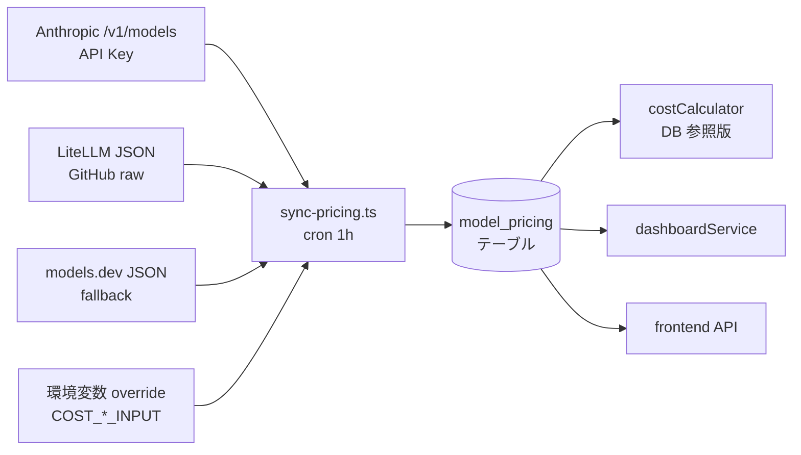

# Draft 002: モデル / 料金レジストリの API 化

> **パンくず**: [README.md](../../README.md) > [docs/](..) > [draft/](.) > **002-model-pricing-registry.md**
> **ステータス**: 🟡 未承認（レビュー依頼中）
> **起票日**: 2026-04-25
> **関連バグ**: #5 (1M premium 未対応), #6 (model ズレ), #11 (コスト表 3 重複)

## 目次

- [問題](#問題)
- [調査結果: 外部データソース比較](#調査結果-外部データソース比較)
- [解決方針](#解決方針)
- [DB 設計](#db-設計)
- [同期フロー](#同期フロー)
- [コード構成の刷新](#コード構成の刷新)
- [1M コンテキスト premium 課金](#1m-コンテキスト-premium-課金)
- [テスト設計](#テスト設計)
- [運用とフォールバック](#運用とフォールバック)
- [タスク分解](#タスク分解)
- [参考文献](#参考文献)

---

## 問題

- 料金テーブルが **3 箇所重複**: `server/src/services/costCalculator.ts`、`server/src/services/dashboardService.ts` `COST_TABLE`、`server/src/lib/constants.ts` `COST_RATES`
- **1M コンテキストの premium 課金未対応**: Anthropic は context > 200K で input 2x / output 1.5x を課金。実トランスクリプト `claude-opus-4-7` セッションはこれを踏む可能性が高いが、現行実装は標準料金のみ
- **モデル ID のズレ**: DB には `claude-opus-4-6` が格納されているが、実トランスクリプトは `claude-opus-4-7`。`session-start` hook 起点の古い値が上書きされないケースがある
- 新モデル（Opus 4.8 / Sonnet 5 等）が出るたびにコード修正 → リリースが必要

## 調査結果: 外部データソース比較

Anthropic 公式は `/v1/models` エンドポイントでモデル一覧は返すが**料金は返さない**。料金取得の候補:

| ソース | 料金 | ライセンス | 更新頻度 | 1M tier | 信頼性 |
|-------|-----|-----------|---------|--------|-------|
| Anthropic `/v1/models` | ❌ 無し | 公式 | リアルタイム | - | 最高 |
| [models.dev](https://models.dev/api.json) | ✅ あり | MIT | 公式追従、数日 | △ 要確認 | 中〜高 |
| [LiteLLM JSON](https://github.com/BerriAI/litellm/blob/main/model_prices_and_context_window.json) | ✅ あり | MIT | 活発 | ✅ 別モデル ID として表現 | 中〜高 |
| OpenRouter `/api/v1/models` | ✅ あり | - | リアルタイム | ✅ 独立モデル ID | 中 |

**推奨**: `LiteLLM JSON` を第一選択。理由:
- 1M tier を `claude-opus-4-1-20250805-context-1m` のような別モデル ID で登録しているため、transcript の実際の model 文字列とマッチすれば自動的に premium 料金を適用できる
- OSS コミュニティが活発、企業の実運用で使われている
- cache_read / cache_write コストも列を持っている

第二選択（フォールバック）: `models.dev` を parallel 取得、差分が大きい場合は警告ログ。

## 解決方針



- **SSOT（単一の情報源）**: `model_pricing` テーブル
- **hook 側**: 従来どおり `session-stop` で `calculateCost` を呼ぶが、実装を DB 参照に切替
- **dashboard 側**: `COST_TABLE` 直書きを廃止し、同じ `calculateCost` を利用
- **frontend**: シミュレーション用に `GET /api/dashboard/models` で料金一覧を取得してキャッシュ

## DB 設計

### 新規テーブル `model_pricing`

| カラム | 型 | 説明 |
|-------|----|------|
| id | INT PK | |
| model_id | VARCHAR(128) UNIQUE | 例: `claude-opus-4-7-20260124`, `claude-opus-4-7-20260124-context-1m` |
| family | VARCHAR(32) | `opus` / `sonnet` / `haiku` |
| tier | VARCHAR(32) | `standard` / `long_context_1m` / `latency_optimized` |
| input_per_mtok | DECIMAL(10,4) | input 料金 $/M tokens |
| output_per_mtok | DECIMAL(10,4) | output 料金 $/M tokens |
| cache_write_per_mtok | DECIMAL(10,4) | cache creation 料金 |
| cache_read_per_mtok | DECIMAL(10,4) | cache read 料金 |
| context_window | INT | 例: 200000, 1000000 |
| max_output | INT | 例: 8192 |
| source | VARCHAR(32) | `litellm` / `models_dev` / `manual_override` / `fallback_default` |
| source_url | VARCHAR(512) | |
| fetched_at | DATETIME | |
| verified | BOOLEAN DEFAULT FALSE | 運用担当者が目視確認済み |
| deprecated | BOOLEAN DEFAULT FALSE | 同期で消えた場合に true（履歴保持） |
| notes | TEXT | premium 挙動、閾値等のメモ |

### インデックス

- `UNIQUE(model_id)`
- `INDEX(family, tier)`
- `INDEX(deprecated, verified)`

### 初期データ

シード（migration）で現行ハードコード値を `source = 'fallback_default'` として投入。初回 cron で LiteLLM の値に上書き（verified=false のまま、運用担当者が確認し verified=true に）。

## 同期フロー

### `scripts/sync-pricing.ts`（新規）

```
1. Anthropic /v1/models → 一覧取得（API Key 必要）
2. LiteLLM raw JSON 取得（認証不要）
3. 各 Anthropic モデル ID について:
   - LiteLLM に同名 or prefix マッチするエントリを検索
   - 料金・context_window を抽出
   - DB に upsert（source='litellm', fetched_at=now）
4. LiteLLM に無い model_id は models.dev を試行
5. 両方で見つからないものは deprecated=true にマーク（削除はしない）
6. 環境変数 COST_* がある場合は override レコードを追加（source='manual_override'）
7. 結果を Slack / ログに出力
```

### 起動タイミング

- サーバ起動時: 1 回実行（ブロッキング、失敗しても fallback_default で動く）
- cron: 1 時間ごと（`node-cron` or Docker sidecar）

### API Key 管理

- `.env` に `ANTHROPIC_API_KEY` を追加（`.env.example` も更新）
- 未設定時は `/v1/models` フェッチをスキップし、LiteLLM からの model_id だけで動作
- API Key は `model_pricing` テーブルの `verified` フラグ運用のみに使用（料金は LiteLLM 経由）

## コード構成の刷新

### Before

```
server/src/services/costCalculator.ts        (DEFAULT_RATES)
server/src/services/dashboardService.ts      (COST_TABLE)
server/src/lib/constants.ts                  (COST_RATES)
```

### After

```
server/src/services/pricingRepository.ts     (新規: DB アクセス)
  - getPricing(modelId): CostRates | null
  - getAllModels(): Model[]
  - syncFromExternal(): Promise<void>

server/src/services/costCalculator.ts        (既存、本体を DB ベースに)
  - calculateCost(modelId, usage): number
    → pricingRepository.getPricing(modelId) を呼ぶ
    → 見つからなければ family fallback → hardcode fallback

server/src/services/dashboardService.ts      (COST_TABLE 削除)
  - getCostRates() → costCalculator.getRates() に委譲

server/src/lib/constants.ts                  (COST_RATES 削除)
  - フロントは /api/dashboard/models から取得
```

### 新 API エンドポイント

`GET /api/dashboard/models`:

```json
{
  "models": [
    {
      "modelId": "claude-opus-4-7-20260124",
      "family": "opus",
      "tier": "standard",
      "inputPerMtok": 15,
      "outputPerMtok": 75,
      "cacheWritePerMtok": 18.75,
      "cacheReadPerMtok": 1.5,
      "contextWindow": 200000,
      "source": "litellm",
      "verified": true
    }
  ]
}
```

## 1M コンテキスト premium 課金

Anthropic 公式:

> When the context window exceeds 200K tokens, input tokens are billed at 2× and output at 1.5× (long_context tier).

### 実装方針

**優先案**: model_id 単位で別レコード化（LiteLLM 方式）

- `claude-opus-4-7-20260124-context-1m` を別レコードで保持し、料金列に premium 済みの値（例: input=30, output=112.5）
- `calculateCost` 呼び出し時に、トランスクリプト由来の model 文字列（既に `-context-1m` 接尾辞を含む）で lookup するだけで済む

**代替案**: tier 列で判定

- `tier='long_context_1m'` レコードを用意し、「入力トークン合計が 200K を超えたら premium 料金を適用」
- ただし tokens = cache_read + cache_creation + input の合計で判定する必要があり複雑

→ **優先案を採用**。model ID の末尾で tier が明確になるため副作用が少ない。

### model ズレ (#6) の同時修正

`handleStop` で `data.model` が `parsed.model` から取得できた場合は必ず session.model を更新（現行コードの条件付き update を unconditional に変更）。

## テスト設計

### 単体テスト

| # | ケース | 期待 |
|---|--------|------|
| P1 | DB に model_id 完全一致あり | DB 値を返す |
| P2 | 完全一致なし、family 一致あり | family fallback 値 |
| P3 | family も不明 | hardcode `sonnet` 既定 |
| P4 | deprecated=true のレコード | 取得可能だが警告ログ |
| P5 | manual_override あり | override を優先 |
| P6 | 1M tier モデル ID | premium 料金で計算される |

### 統合テスト

- `sync-pricing.ts` mock: LiteLLM 応答 fixture → DB に期待レコードが生成
- Anthropic API mock: `/v1/models` から取得したリストが LiteLLM と照合されること
- 既存セッションの cost 再計算: before/after で差分が 1M tier 課金として正しく出ること

### E2E テスト

- `/api/dashboard/models` が正しい JSON を返す
- `ModelSimulationTable.tsx` が API 経由で料金を取得できる
- cron が 1h 間隔で動くこと（テストでは 10 秒に短縮）

## 運用とフォールバック

### フォールバック順序

```
calculateCost(modelId, usage):
  1. model_pricing テーブル完全一致 ← 優先
  2. 同 family の standard tier
  3. costCalculator.ts 内のハードコード既定値（壊滅時の保険）
  4. sonnet standard をデフォルト
```

### 異常時の挙動

- LiteLLM fetch 失敗: DB に既存データがあれば継続、警告ログ + Slack 通知
- DB 障害: ハードコード既定値で動作継続
- 新モデルが transcript に出現、同期がまだ: family fallback で概算計算 + Slack で「新モデル検出」通知

### 運用担当者の作業

- Slack 通知を確認し、新モデル追加や premium 検出時に `verified=true` で手動承認
- admin UI で manual_override を追加（社内独自料金プラン対応）

## タスク分解

承認後 `docs/tasks/list.md` に登録予定:

- T1: Prisma schema に `model_pricing` テーブル追加、migration 作成
- T2: `pricingRepository.ts` 実装 + テスト（P1〜P6）
- T3: `scripts/sync-pricing.ts` 実装（LiteLLM + Anthropic API + override）
- T4: `costCalculator.ts` を DB 参照版に置換、既存テスト緑
- T5: `dashboardService.ts` の `COST_TABLE` 削除、`getCostRates` 委譲
- T6: `server/src/lib/constants.ts` の `COST_RATES` 削除、frontend API 化
- T7: `GET /api/dashboard/models` 追加
- T8: `ModelSimulationTable.tsx` を API fetch 版に
- T9: cron 組込み（node-cron）
- T10: `handleStop` の model 上書きを unconditional に
- T11: admin UI で manual override 追加（別 draft を起票予定）
- T12: `.env.example` に `ANTHROPIC_API_KEY` 追加、README 更新

## 参考文献

- [Anthropic Pricing](https://www.anthropic.com/pricing) — 公式料金ページ（スクレイピング対象外、確認用）
- [Anthropic Models API](https://docs.anthropic.com/en/api/models-list) — `/v1/models` 仕様
- [LiteLLM model_prices JSON](https://github.com/BerriAI/litellm/blob/main/model_prices_and_context_window.json) — 一次候補ソース、MIT
- [models.dev API](https://models.dev/api.json) — フォールバックソース
- [Anthropic Long Context Pricing Announcement](https://www.anthropic.com/news/200k-context-windows) — 1M tier 課金仕様
